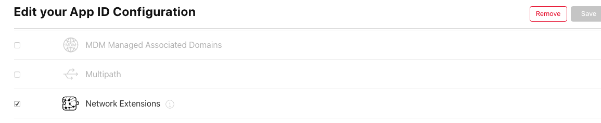
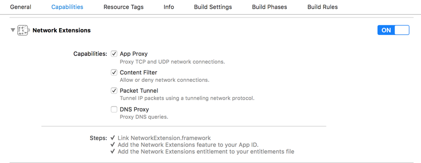
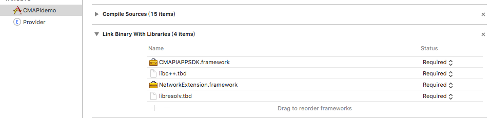
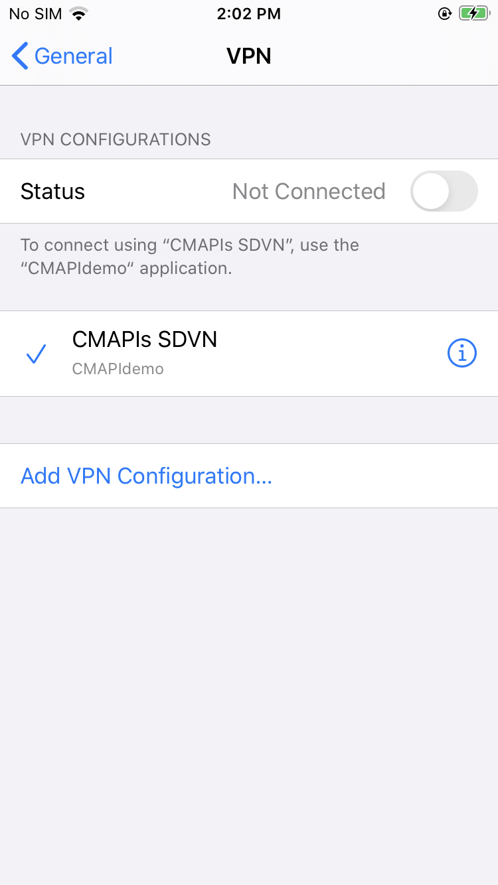
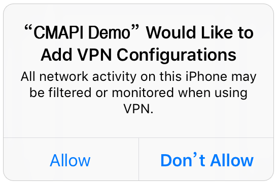
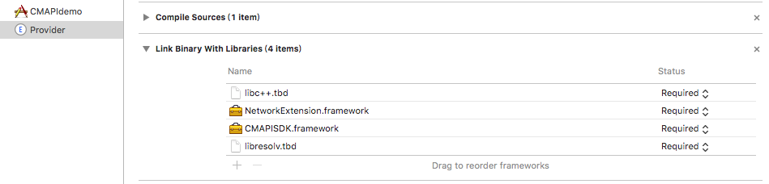

# **Weline iOS SDK **Access Guides


Secret level: Secret

* * *

# **About Guides**

- Copyright Notice

  **Weline.io** © 2021 All rights reserved. Unless otherwise specified, the copyright of any text description, document format, illustration, photo, method, process, etc. appearing in this document belongs to **Weline.io** and is protected by relevant property rights and copyright laws. Without the written permission of **Weline.io**, it is not allowed to copy, distribute, reproduce, disclose or rewrite all or part of this document.

- Information Update

  This document is only used to provide information for NDA users, and it can be changed or withdrawn by **Weline.io** at any time.

- Disclaimer

  In accordance with the scope of the applicable law, **Weline.io** provides this document "as is" and does not assume any form of guarantee, including (but not limited to) any implied marketability, suitability for special purposes, or non-infringement. Under any circumstances, **Weline.io** will not be liable for any direct or indirect loss or damage caused by the end user or any third party due to the use of the SDK/backend interface according to the instructions, even if **Weline.io** is clearly aware of these losses or damages, These damages include (but are not limited to) loss of profits, business interruption, reputation or loss of data.

- Who should read this Guides

  The readers of this guides are developers of third-party vendors who have signed an NDA (non-disclosure agreement) with **Weline.io**.

- Secret Level
	
	The confidentiality of this guides is secret, and it is forbidden to open this file to non-NDA companies or individuals.

* * *
# catalogue

[TOC]

* * *
date | Version | remarks                                  
---|---|---
2018/12/29|v1.0.2|Finish the first draft
2019/09/05|v1.0.3|Finish the first draft
2019/01/03|v1.0.4|Modify interface (add synchronization mode)
2020/04/10|v1.0.5|Add DLT configuration item interface
2020/09/21|v1.0.6|Add access guide and access process
2020/11/17|v1.0.7|Add access to SMS verification code interface and partner account verification interface
2020/12/01|v1.0.8|Add the interface of setting log file storage path and setting log level
2020/5/17|v2.0.0|Revised

## 1.Summary

​		This document describes the Weline.io SDK used on the iOS platform when third-party vendors integrate virtual networks. Its purpose is to allow third-party developers’ developers to quickly embed virtual network functions into third-party applications.

​		This document is suitable for the company's internal and third-party R&D personnel who have signed the NDA to read.

## 2.System requirements

​		The running target system requires iOS 9.0 or above (including iOS 9.0), and the system below iOS 9.0 does not provide technical support。

## 3.Preparation

Before using the weline.io SDK, please contact weline.io Inc. for SDK authorization. After authorization, you will get an appid and a partnerid。

Before using CMAPIDemo, you need to execute the **./build_before.sh** command under projectDir

```
./build_before.sh
```


​	The weline.io SDK package distributed with this document includes the following：

- CMAPIAPPSDK.framework
- CMAPISDK.framework

## 4.Access Guide

The access of SDK is divided into two parts：

- In the main program part, CMAPIAPP SDK is used to communicate with Provider

- PacketTunnelProvider parts， usingCMAPISDK SDK to establish tunnels and process data requests initiated by the main program


Note：Network Extension permission should be configured。Network Extension is different from other permissions，Unable to enable in Xcode compalities with one click，You need to manually apply for profile in Apple Developer Center。You need to create a profile for both the main program and the Provider, as shown in the figure below：




## 5.Access process

### 5.1. Main program part

#### 5.1.1.Project configuration

- Create Provider Target

  After you create a project, create another one Provider Target As shown in the figure below（Due to unknown reasons, apple deleted this file in Mac OS 10.12, so we need to extract or download it from 10.11 system. Install NEProviderTargetTemplates.pkg）。After creation, the PacketTunnelProvider class，will be generated. Please refer to 4.2.Provider for detailed operation of this class。

  

- Open Network Extensions permission

  ​	Select the main programs TARGETS，Click Capabilities，Turn on the Network Extensions switch。Network Extensions Check App Proxy、Content Filter、Packet Tunnel。As shown in the figure below：

  

- Import Framework、Add dependency Library

  ​	Select the main programs TARGETS，Click Build Phases，Import in Link Binary With Libraries CMAPIAPPSDK.framework、NetworkExtension.framework，And add the required dependency libraries libc++.tdb、libresolv.tdb，As shown in the figure below：

  

#### 5.1.2.Development process

Step 1. Import related header file

```objc
#import <CMAPIAPPSDK/cmapiApp.h>
```

Step 2. Initialize the data

​	After entering the APP，you need to configure the following data first。

​	（1）Set kVPNId，which is used to set the display name of VPN configuration in the VPN setting UI of the system。

​		Code examples：

```objc
[cmapiApp sharedInstance].kVPNId = @"CMAPIs SDVN";
```

​		The interface is as follows：

​		

​	（2）Set kProviderBundleid，This property is used to specify which tunnel provider extension should be used in this configuration。Set the Bundle Identifier of the provider target created earlier to kProviderBundleid。

​		The code example is as follows：

```objc
[cmapiApp sharedInstance].kProviderBundleid = @"net.memenet.CMAPIdemo.provider";
```

​	（3）Set kServerAddr，This property is used to set the tunnel server address. Fill in the available domain name address。

​		The code example is as follows：

```objc
[cmapiApp sharedInstance].kServerAddr = @"xxxxxx";
```

Step 3. Add monitoring of VPN connection status

​	Before logging in, you need to set the monitoring of VPN connection status and notify by setting proxy. App does the corresponding operation according to the returned status。

​	The code example is as follows：

```objc
//Set up Delegate
[cmapiApp sharedInstance].statusDelegate = self;

//Delegate method
- (void)statusChange:(CONNECTION_STAT)status Dr:(int)dr {
    if (CCS_CONNECTING == status) {	//Connecting
        
    }else if (CCS_CONNECTED == status) {	//Connected
        
    }else if(CCS_DISCONNECTING == status) {	//Logging out
        
    }else if(CCS_DISCONNECTED == status) {	//Logged out
        
    }
    
}
```

Step 4. Check whether the system VPN is connected by other applications (optional)

​	After entering the APP, first call the method to detect the current connection status of the system VPN, and then do the corresponding operation according to the requirements。

​	Note: this step can be used according to the requirements of APP. If the system VPN is occupied or not, it is not necessary to use this method。

​	The code example is as follows：

```objc
[[cmapiApp sharedInstance] CheckOtherVPNIsConnected:^(BOOL result) {
    if (!result) {	//System VPN not occupied
    }else {	//System VPN occupied
    }
}];
```

Step 5. VPN configuration authorization, create / obtain the VPN configuration of the current APP

​	After entering the APP, you must use the createSessionWithCompletionHandler to authorize the VPN configuration，and create / obtain the VPN configuration of the current APP。

​	Note：

​	（1）When the APP starts for the first time, calling this method will pop up the VPN authorization box. The user must allow it to perform the following operations. After the user agrees to the authorization, the VPN configuration of the current APP will be created, and the configured VPN information can be viewed in the system VPN settings；



​	（2）When the system VPN is occupied by other apps, this method can be used to switch the VPN of the current app (at this time, the VPN status is not connected, you need to execute the login method to connect)；

​	（3）Before executing the login method, this method must be called because if the VPN configuration is occupied by other VPN, you need to use this method, switch to the VPN of the current app, and then execute the login method。

​	The code example is as follows：

```objc
[[cmapiApp sharedInstance] createSessionWithCompletionHandler:^(BOOL result) {
        if (result) {	
          //VPN configuration authorized
        }else {
          //If the VPN configuration is not authorized, you need to prompt the user for authorization and call this method again to pop up the VPN authorization box
        }
}];
```

Step 6. Get the basic information

​	By using getBaseInfo to get the basic information, the following functions can be realized：

​	（1）show historical login account；

​	（2）show last successful login account；

​	（3）if you need to automatically log in after the APP starts，you need to get the basic information (getBaseInfo), the last login account and the status of the current virtual network after executing the createSessionWithCompletionHandler method。

​	The code example is as follows：

```objc
[[cmapiApp sharedInstance] createSessionWithCompletionHandler:^(BOOL result) {
        if (result) {
            NSDictionary *result = [[cmapiApp sharedInstance] getBaseInfo:nil];
            if (result) {
                NSDictionary *informationDic = [result objectForKey:@"information"];
                NSString *current_account = [informationDic objectForKey:@"account"];	//Last successful login account
                NSDictionary *history_accounts = [result objectForKey:@"users"];	//Historical account number
                int status = [[informationDic objectForKey:@"status"] intValue];
                if (status == CCS_CONNECTED) {

                }else {
                  //if current_account is not empty，and status == CCS_DISCONNECTED，you can  use current_account realizes automatic login
                    if (![current_account isEqualToString:@""] && status == CCS_DISCONNECTED) {
                        [[cmapiApp sharedInstance] loginWithAccount:current_account password:@""];
                    }
                }
            }
        }
    }];
```

Step 7. Login

​	There are five ways to log in to the virtual network by using the login method. Please refer to 7.4

​	Note：

​	（1）Login can only be executed when VPN status is not connected；

​	（2）It is necessary to detect whether the VPN is occupied by other apps. If it is occupied, you can not log in directly by using the login method. You need to use the createSessionWithCompletionHandler method to switch to the VPN of the current app, and then execute the login method。

​	The code example is as follows：

```objc
[[cmapiApp sharedInstance] CheckOtherVPNIsConnected:^(BOOL result) {
        if (!result) {	//VPN not occupied
            [[cmapiApp sharedInstance] loginWithAccount:account password:password];
        }else {	//VPN occupied
          //如If it is occupied but wants to get it back, you can use the createSessionWithCompletionHandler to switch to the VPN of the current app, or you can pop up a prompt box to let the user choose whether to switch to the VPN of the current app
          [[cmapiApp sharedInstance] createSessionWithCompletionHandler:^(BOOL result) {
            if (result) {
              [[cmapiApp sharedInstance] loginWithAccount:account password:password];
            }
          }];
    }];
```

Step 8. Log out
	Use the stopLogin method to cancel the connection in progress or stop the login operation that has been connected。

​	Note：this method needs to be executed when the login status is  CCS_CONNECTING or CCS_CONNECTED。

​	The code example is as follows：

```objc
[[cmapiApp sharedInstance] stopLogin];
```

### 5.2. PacketTunnelProvider part

#### 5.2.1.project configuration

- open Network Extensions permission

  ​	Select Provider TARGETS，click Capabilities，turn on theNetwork Extensions switch。Network Extensions check App Proxy、Content Filter、Packet Tunnel。As shown in the figure below：

  

- Import Framework、Add dependency Library

  ​	Select the main program TARGETS，click Build Phases，import in Link Binary With LibrariesCMAPISDK.framework、NetworkExtension.framework，And add the required dependency libraries libc++.tdb、libresolv.tdb，As shown in the figure below：

#### 

#### 5.2.2.Development process

​	In creating the Provider Target project，the PacketTunnelProvider class will be generated automatically，In this class, some methods are unnecessary and can be deleted。

Step 1. Import related header file

```objc
#import <CMAPISDK/cmapi.h>
```

Step 2. Initialization

（1）Define cmapi properties

```objc
@interface PacketTunnelProvider ()
@property (nonatomic, strong)  cmapi * cmapi;
@end
```

（2）Initialization

```objc
- (instancetype) init {
    self = [super init];
    if (self) {
        if (nil == _cmapi) {
             //Initialize and set AppID 、PartnerID、DeviceClass（These three values need to be applied to weline.io Inc）
            _cmapi = [[cmapi alloc]initLibraryWithAppID:AppID withPartnerID:PartnerID withDevClass:DC_COMMON_IOS AndProvider:self AndDnsDivert:true];
            //Registration notice (used to inform the current tunnel to be occupied by other app）
            [self registUserNotificationCenter];
          	//Set the log level (generally set to 5)
          	[_cmapi setOutputLogLevel:5];
        }
    }
    return self;
}

```

Step 3: set up login account, login password, network environment and start channel establishment

Note: after the main program uses the login method, the login account, login password and other information will be transferred to the provider layer through this method. The data here does not need to be managed, and can be implemented according to the following method。

```objc
- (void)startTunnelWithOptions:(NSDictionary *)options completionHandler:(void (^)(NSError *))completionHandler
{
    
    if (nil != options) {
        //Establish a channel through the account data passed by the UI process
        [_cmapi startConnectionWithOptions:options completionHandler:completionHandler];
    }else{
        //When you have successfully logged in, turn on the VPN switch in the system settings, and the channel will be established through this method with the last login account
        [_cmapi startConnectionWithOptions:nil completionHandler:completionHandler];
    }
}
```

Step 4. General interface, data interaction with main program

```objc
- (void)handleAppMessage:(NSData *)messageData completionHandler:(void (^)(NSData *))completionHandler
{
    [_cmapi processAppMessage:messageData completion:completionHandler];
}
```

Step 5. Call the stop channel method

Note: as VPN tunnel may be preempted by other VPNs, users can be informed by adding notification。

```objc
- (void)stopTunnelWithReason:(NEProviderStopReason)reason completionHandler:(void (^)(void))completionHandler
{
    [_cmapi stopTunnel:completionHandler];
    if (reason == NEProviderStopReasonSuperceded || reason == NEProviderStopReasonConfigurationDisabled) {
				//VPN is preempted. The current VPN has been disconnected
        [self createLocationNotification];
    }
}
```

Step 6. Create push notification

（1）Sign up for push notification

```objc
- (void)registUserNotificationCenter {
    //Registration notice
    UNUserNotificationCenter *center = [UNUserNotificationCenter currentNotificationCenter];
    //    center.delegate = self;
    [center requestAuthorizationWithOptions:(UNAuthorizationOptionBadge | UNAuthorizationOptionSound | UNAuthorizationOptionAlert) completionHandler:^(BOOL granted, NSError * _Nullable error) {
        if (granted) {
            NSLog(@"request authorization successed!");
        }
    }];
    //Before registering for the push service, we have no way to know whether the user clicks agree or disagree, and what changes the user has made. Now Apple has opened the API, and we can get the users setting information directly。
    [center getNotificationSettingsWithCompletionHandler:^(UNNotificationSettings * _Nonnull settings) {
        NSLog(@"%@",settings);
    }];
}
```

（2）Create push notification

```objc
-(void)createLocationNotification {
    [self locationNotifcation];
}

-(void)locationNotifcation{
    UNUserNotificationCenter *center = [UNUserNotificationCenter currentNotificationCenter];
    //Request permission for notification (corner marker, voice, pop-up box)
    [center requestAuthorizationWithOptions:(UNAuthorizationOptionBadge | UNAuthorizationOptionSound | UNAuthorizationOptionAlert) completionHandler:^(BOOL granted, NSError * _Nullable error) {
        if (granted) {
            //Get whether the user agrees to open the notification
            NSLog(@"request authorization successed!");
        }
    }];
    
    //Step 2: create a new notification content object
    
    UNMutableNotificationContent *umnot =[[UNMutableNotificationContent alloc] init];
    umnot.title = @"";
    umnot.subtitle = @"";
    umnot.body = @"because the system VPN has been occupied by other apps, the current link has been disconnected";
    umnot.badge = @1;
    //    UNNotificationSound *sound = [UNNotificationSound soundNamed:@"caodi.m4a"];
    //    umnot.sound = sound;
    
    //Step 3: notification trigger mechanism（Repeat the reminder, the time interval should be greater than 60s) 
    UNTimeIntervalNotificationTrigger *trigger1 = [UNTimeIntervalNotificationTrigger triggerWithTimeInterval:1 repeats:NO];
    
    //Step 4: create an unnotificationrequest notification request object
    NSString *requertIdentifier = @"RequestIdentifier";
    UNNotificationRequest *request = [UNNotificationRequest requestWithIdentifier:requertIdentifier content:umnot trigger:trigger1];
    
    //Step 5: add the notification to the notification center
    [[UNUserNotificationCenter currentNotificationCenter] addNotificationRequest:request withCompletionHandler:^(NSError * _Nullable error) {
        NSLog(@"Error:%@",error);
        
    }];
  
}
```

## 6. CMAPISDK interface description

### 6.1.initialization

This interface needs to be used in the - (instancetype) init method of NEPacketTunnelProvider

```objc
// appId : Product ID, which is assigned for each product
// partnerID : partner ID, which is assigned by the background of weline.io
// devClass : device type code, which is used to distinguish multiple types of devices under the same product ID
// provider : NEPacketTunnelProvider
// dnsDivert : If you use the domain name of the virtual network, you need to set DNS, otherwise it is the opposite

-(id) initLibraryWithAppID:(NSString *)appId withPartnerID:(NSString *)partnerID withDevClass:(NSInteger)devClass AndProvider:(NEPacketTunnelProvider *)provider AndDnsDivert:(BOOL)dnsDivert;
```

### 6.2.DNS Filter settings

This interface needs to be used in the - (instancetype) init method of NEPacketTunnelProvider

```objc
//nagation：false is the DNS resolution of virtual network on rule matching, and the DNS resolution of real network on unmatched
//             true is the DNS resolution of real network on rule matching, and the DNS resolution of virtual network on unmatched
//items：the domain name to be transited, such as：@["*.cmhk.com"]
- (void)setPacOptionNagation:(BOOL)nagation items:(NSArray *)items;
```

### 6.3.Set AS address and port

This interface needs to be used in the - (instancetype) init method of NEPacketTunnelProvider

```objc
//asHost：AS address
//asPort：AS port
- (void)setAsHost:(NSString *)asHost withAsPort:(unsigned short)asPort
```

### 6.4.Channel connection

This interface needs to be used in the  - (void)startTunnelWithOptions:(nullable NSDictionary<NSString *,NSObject *> *)options completionHandler:(void (^)(NSError * __nullable error))completionHandler method of NEPacketTunnelProvider

```objc
//There are two connection methods：
//method 1: this method will connect with data
// options : pass in options in startTunnelWithOptions method
// completionHandler : pass in completionHandler in startTunnelWithOptions method

- (void)startConnectionWithOptions:(NSDictionary *)options completionHandler:(void (^)(NSError *  error))completionHandler;

//Method 2: only show VPN icon, no other data (only for testing, belong to false connection, can be used for Apple audit account) 
- (void)fakeConnectionWithCompletionhandler:(void (^)(NSError *  error))completionHandler;
```

### 6.5.Stop channel connection

This interface needs to be used in the  (void)stopTunnelWithReason:(NEProviderStopReason)reason completionHandler:(void (^)(void))completionHandler method of NEPacketTunnelProvider

```objc
// completionHandler : pass in completionHandler in stopTunnelWithReason method 

-(void)stopTunnel:(void (^)(void))completionHandler;
```

### 6.6.Data interaction

This interface needs to be used in the - (void)handleAppMessage:(NSData *)messageData completionHandler:(void (^)(NSData *))completionHandler method of NEPacketTunnelProvider

```objc
// data : pass in messageData in handleAppMessage method
// completionHandler : pass in completionHandler in handleAppMessage method 

- (void) processAppMessage:(NSData *)data completion:(void (^)(NSData *))completionHandler;
```

### 6.7.Set log level

This interface needs to be used in the - (instancetype) init method of NEPacketTunnelProvider，and is called after cmapi init。

```objc
-(void)setOutputLogLevel:(int)logLevel;
```

- description:


```js
（1）This interface needs to be connected with - (void)setLogPath:(NSString *)path interface in CMAPIAPPSDK.framework，because if the log file storage path is not set, the log will not be output；
（2）If you do not need to view the log, please do not use this interface；
（3）If there is no special case, the log level can be set to 5。
```

## 7. CMAPIAPPSDK Interface description

The main program communicates with Provider through  CMAPIAPPSDK.framewowrk。

Note: the interface to obtain data can be obtained by synchronous or asynchronous method. If asynchronous is used, there is no return value. such as：

- Synchronization mode：

	NSDictionary *result = [[cmapiApp sharedInstance] getBaseInfo:nil];
- Asynchronous mode：

   [[cmapiApp sharedInstance] getBaseInfo:^(NSDictionary *result) {
        
   }];

### 7.1.  Set VPNID、AppGroupID、Provider process BundleID、Server address

```objc
[cmapiApp sharedInstance].kVPNId = @"xxxx SDVN";
[cmapiApp sharedInstance].kProviderBundleid = @"xxxxxx";
[cmapiApp sharedInstance].kServerAddr = @"xxxxxx";
```
- explain:
Parameter is the parameter that must be set to set the network extension。

### 7.2.  Check whether the system VPN has been connected by other applications
his interface suggests that this method should be executed before createSessionWithCompletionHandler and login，After receiving the return value of completionHandler，if NO is returned，then createSessionWithCompletionHandler or login  login should be executed，if YES is returned，VPN will not be created and login cannot be executed

```objc
- (void)CheckOtherVPNIsConnected:(void (^)(BOOL result)) completionHandler;

// result : BOOL YES（Indicates that the system VPN is connected） NO（Indicates that the system VPN is not connected）
```

### 7.3. Create a connection session and get authorization or not
This interface only works when the login status is CS_DISCONNECTED

```objc
- (void) createSessionWithCompletionHandler:(void (^)(BOOL result)) completionHandler;

// result : BOOL YES Indicates that the user is authorized to start the network extension service, and NO indicates that the user is not authorized
```

### 7.4. Login

This operation is performed after the createSessionWithCompletionHandler，and the login status is CCS_DISCONNECTED

#### 7.4.1.Login

Note: this interface passes in relevant parameters according to auxiliary verification mode and authentication mode

```objc
//account ：username 
//password ：password 
//thirdCode ：The code used by the third party authentication, instead of the account password (if there is no code, it will be sent to blank)
//auxAuthMode ： Auxiliary verification mode（AAM_NONE：No secondary validation is required，AAM_SMS：Use SMS password for auxiliary verification）
//auxAuthValue ： SMS verification code
//authMethod: Authentication mode
- (void) loginWithAccount:(NSString *)account password:(NSString *)password thirdCode:(NSString *)thirdCode auxAuthMode:(AUX_AUTHENTICATE_MODE)auxAuthMode auxAuthValue:(NSString *)auxAuthValue authMethod:(AUTH_METHOD)authMethod
```
#### 7.4.2.Static password login

Note: you can call this method to login with user name and password according to the user's user name and password。

```objc
//account ：username
//password ：password
- (void) loginWithAccount:(NSString *)account password:(NSString *)password;
```

#### 7.4.3.SMS password login

Note: if you need to use the SMS verification code login function of weline.io platform, you can consult the relevant staff of weline.io Inc. to open the SMS verification function. You can choose to use our SMS verification service, or connect your own SMS verification service. The address Host, Port and authentication mode of SMS interface should be configured when sending SMS。

（1）Get SMS verification code

```objc
 	//account : username
 	//host ：address of SMS interface
 	//port ：port of SMS interface
 	//authmode ：authentication mode of SMS interface
  - (RET_SMS_STAT)getCodeWithAccount:(NSString *)account withHost:(NSString *)host withPort:(NSString *)port withAuthmode:(int)authmode;
```

- RET_SMS_STAT definition:

  ```js
  typedef enum{
      RET_SUCCESS = 0,      // Successfully processed
      ERR_USER_NOT_EXIST = 101,   // user does not exist
      ERR_SERVER_ERROR     =  102,   // Server internal error
      ERR_SEND_SMS_FAILED   = 103,    // Failed to send SMS
      ERR_NOT_BIND_PHONE    = 104,   // User is not bound to mobile phone
      ERR_INVALID_REQUEST   = 105,  // invalid request
      ERR_INVALID_PASSWORD =  106,    // Password verification error
      ERR_FREQUENTLY_REQ    = 107,    // Apply too often, try again later
      ERR_INVALID_PASSWORD_TOO_MUCH = 108,  //Password error, application error more than 3 times
  }RET_SMS_STAT;
  ```

- RET_SMS_STAT description:

  | Definition                    | Value | Description                                         |
  | ----------------------------- | ----- | --------------------------------------------------- |
  | RET_SUCCESS                   | 0     | Successfully processed                              |
  | ERR_USER_NOT_EXIST            | 101   | user does not exist                                 |
  | ERR_SERVER_ERROR              | 102   | Server internal error                               |
  | ERR_SEND_SMS_FAILED           | 103   | Failed to send SMS                                  |
  | ERR_NOT_BIND_PHONE            | 104   | User is not bound to mobile phone                   |
  | ERR_INVALID_REQUEST           | 105   | invalid request                                     |
  | ERR_INVALID_PASSWORD          | 106   | Password verification error                         |
  | ERR_FREQUENTLY_REQ            | 107   | Apply too often, try again later                    |
  | ERR_INVALID_PASSWORD_TOO_MUCH | 108   | Password error, application error more than 3 times |

（2）SMS password login

```objc
//account ：username
//password ：SMS password
- (void)loginBySmsWithAccount:(NSString *)account smsCode:(NSString *)smsCode;
```

#### 7.4.4.token Login

Note: the system supports the token provided by the third party platform for login。

（1）After obtaining the token, you can call the loginByTokenWithAccount method to log in

```objc
//account ：username
//token ：One click login with token
- (void)loginByTokenWithAccount:(NSString *)account token:(NSString *)token;
```

（2）Partner account verification

​		The system supports the verification of account number of unified third-party platform and returns the specified information of the third party（ Optional and need to be executed after logging in to the virtual network)

```objc
//generateDomain : generate token domain name
//verifyDomain : verify token domain name
//appkey : Appkey applied
//eAppid : eAPPID applied
//appid : appid applied
//partnerid ：partnerid applied
- (void)verifyPartnerAccountWithGenerateDomain:(NSString *)generateDomain verifyDomian:(NSString *)verifyDomain appKey:(NSString *)appkey eAppid:(NSString *)eAppid appid:(NSString *)appid partnerid:(NSString *)partnerid completion:(void (^)(NSDictionary *dict,NSError *error)) completion;
```

- Description:

```js
（1）Domain name parameter, with port number, such as XXX. XX. XX: 8080; If there is no special case, the domain name port of generating token is 8445, and the port of verifying token is 9443.
（2）When the request fails, you can view the content returned by errmsg in dict or the content of error for specific error information.
```

#### 7.4.5.Fake connection (login mode with VPN icon only)

```objc
- (void)fakeLogin;
```

### 7.5. Log out
- Cancel the connection in progress or stop the login operation that has been connected

```objc
- (void)stopLogin;
```
- Description:

```js
After calling the logout method, in the - (void) statusChange:(CONNECTION_STAT)status Dr:(int)dr; when the status is CCS_DISCONNECTED, the logout is successful
```
### 7.6. Get the current VPN connection status

```objc
//return（CONNECTION_STAT）：VPN connection status value

- (CONNECTION_STAT)getCurrentStatus;
```
- Description:

```js
This interface needs to be used after the createSessionWithCompletionHandler
```

### 7.7. Get virtual network login status information
This interface is generally used to obtain the delay, speed, flow and other information of virtual tunnel after successful login

```objc
- (NSDictionary *)getStatusInfo:(void (^)(NSDictionary * result)) completion;
```

- Login status

```js
typedef enum
{
    CCS_UNKNOWN = 0, //Unknown
    CCS_PREPARE,     //Ready for internal initialization
    CCS_CONNECTING,  //Logging in
    CCS_CONNECTED,   //Login status, virtual network tunnel has been activated
    CCS_DISCONNECTED,//Logout status, virtual network tunnel is not activated
    CCS_AUTHTICATED, //Authentication completed, virtual network tunnel not activated
    CCS_UNACTIVE, // Device not activated for non terminal type devices
    CCS_ACTIVING, // Device active
    CCS_DISCONNECTING,  // Disconnecting
    CCS_WAIT_RECONNECTING, //Waiting for reconnection
} CONNECTION_STAT;

```
- Login status description

  | Login status          | Value | Status Description                                           |
  | --------------------- | ----- | ------------------------------------------------------------ |
  | CCS_UNKNOWN           | 0     | Unknown                                                      |
  | CCS_PREPARE           | 1     | Program internal initialization use                          |
  | CCS_CONNECTING        | 2     | Logging in                                                   |
  | CCS_CONNECTED         | 3     | Login succeeded. Virtual tunnel is activated in this state, and all information and status information related to virtual network can be obtained |
  | CCS_DISCONNECTED      | 4     | Log out successfully. In this state, the virtual tunnel is disconnected and the virtual network is not available. Only a small amount of information (such as historical account number, etc.) can be obtained |
  | CCS_AUTHTICATED       | 5     | Authentication completed, virtual network tunnel not activated |
  | CCS_UNACTIVE          | 6     | Device not activated for non terminal type devices           |
  | CCS_ACTIVING          | 7     | Device active                                                |
  | CCS_DISCONNECTING     | 8     | Disconnecting                                                |
  | CCS_WAIT_RECONNECTING | 9     | Waiting for reconnection                                     |


- Reason definition of device in login state

```js
typedef enum
{
    DR_UNSET = 0,
    DR_BY_USER,     //1. Call the logout interface. 2. The device is powered on, but the automatic logout is not set
    DR_MISVERSION,      //Version too low (restricted login)
    DR_NETWORK_TIMEOUT,     //Interruption of network connection with background server (such as background upgrade)
    DR_MISSING_INFO,        //No account information has been configured or the device account information is lost
    DR_INVALID_USER,    //Invalid username
    DR_INVALID_PASS,    //Invalid password
    DR_DEVICE_DELETED,    //The device is deleted by the management side
    DR_DEVICE_ONLINE,    //A device of this SN is online
    DR_DEVICE_DISABLED,    //The device is restricted from logging in
    DR_MAX_DEVICE=10,    //The number of equipment exceeds the limit
    DR_NO_NETWORK,    //No virtual network available (not normally)
    DR_KO_USER_REMOVED,    //User removed by a virtual network owner
    DR_KO_DEVICE_REMOVED,    //Device removed by a virtual network owner
    DR_KO_DEVICE_DELETED,    //The device was deleted by a virtual network manager
    DR_TUN_DEVICE,    //There is no tun device available in the system, or other programs of tun0 device are occupied
    DR_DTYPE_CHANGED,    //Device is upgraded to supernode (used by specific device)
    DR_NETWORK_UNUSABLE,    //No Internet available (e.g. device cable is disconnected)
    DR_USER_RELOGIN,    //The user logged in again
    DR_ALGO_TYPE_CHANGED,    //Tunnel algorithm changed
    DR_AUX_AUTH_DISMATCH=20,    //Authentication mode mismatch
    DR_INVALID_AUTHORIZATION,    //Invalid authorization
    DR_PROTOCOL,               //Protocol error
    DR_NETWORK_BROKEN,         //Network interruption
    DR_KICKOUT_BY_AS,          //Forced offline
    DR_INVALID_SMS,         //SMS password has expired. You need to apply for SMS password again
    DR_INVALID_TICKET,      //Invalid ticket
    DR_TRY_TOO_MANY_TIMES,      //Too many login attempts
    DR_CALL_THIRD_API_FAIL,     //Failed to connect with the third party interface
    DR_INVALID_CODE = 30,   //Invalid third party code
    DR_WAKE_UP,     //The system is dormant, causing network interruption, and will be automatically reconnected after the wake-up of sleep
    DR_VPN_UNAUTHORIZED=2018,   //VPN not authorized
    DR_VPN_SERVER_CONNECT_FAIL=2019,   //Failed to start VPN service
} DISCONNECT_REASON;
```

- The reason why the device is in the logout state

  | Logout status error code   | Value | Error code description                                       |
  | -------------------------- | ----- | ------------------------------------------------------------ |
  | DR_UNSET                   | 0     | Unknown                                                      |
  | DR_BY_USER                 | 1     | 1. Call the logout interface. 2. The device is powered on, but the automatic logout is not set |
  | DR_MISVERSION              | 2     | Version too low (restricted login)                           |
  | DR_NETWORK                 | 3     | Interruption of network connection with background server (such as background upgrade) |
  | DR_MISSING_INFO            | 4     | No account information has been configured or the device account information is lost |
  | DR_INVALID_USER            | 5     | Invalid username                                             |
  | DR_INVALID_PASS            | 6     | Invalid password                                             |
  | DR_DEVICE_DELETED          | 7     | The device is deleted by the management side                 |
  | DR_DEVICE_ONLINE           | 8     | A device of this SN is online                                |
  | DR_DEVICE_DISABLED         | 9     | The device is restricted from logging in                     |
  | DR_MAX_DEVICE              | 10    | The number of equipment exceeds the limit                    |
  | DR_NO_NETWORK              | 11    | No virtual network available (not normally)                  |
  | DR_KO_USER_REMOVED         | 12    | The user is removed by a virtual network manager             |
  | DR_KO_DEVICE_REMOVED       | 13    | Device removed by a virtual network manager                  |
  | DR_KO_DEVICE_DELETED       | 14    | The device was deleted by a virtual network manager          |
  | DR_TUN_DEVICE              | 15    | There is no Tun device available in the system, or tun0 device is occupied by other programs (limited to Linux platform) |
  | DR_DTYPE_CHANGED           | 16    | The device is upgraded to super node (limited to Linux platform) |
  | DR_NETWORK_UNUSABLE        | 17    | No Internet available (e.g. device cable is disconnected)    |
  | DR_USER_RELOGIN            | 18    | The user logged in again                                     |
  | DR_ALGO_TYPE_CHANGED       | 19    | Tunnel algorithm changed                                     |
  | DR_AUX_AUTH_DISMATCH       | 20    | Authentication mode mismatch                                 |
  | DR_INVALID_AUTHORIZATION   | 21    | Invalid authorization, invalid appid and partnerid           |
  | DR_PROTOCOL                | 22    | Protocol error                                               |
  | DR_NETWORK_BROKEN          | 23    | Network interruption                                         |
  | DR_KICKOUT_BY_AS           | 24    | Kicked off line                                              |
  | DR_INVALID_SMS             | 25    | SMS password has expired. You need to apply for SMS password again |
  | DR_INVALID_TICKET          | 26    | Invalid ticket                                               |
  | DR_TRY_TOO_MANY_TIMES      | 27    | Too many login attempts                                      |
  | DR_INVALID_DEVICE_CLASS    | 28    | Invalid device type                                          |
  | DR_CALL_THIRD_API_FAIL     | 29    | Failed to connect with the third party interface             |
  | DR_INVALID_CODE            | 30    | Invalid third party code                                     |
  | DR_WAKE_UP                 | 31    | If the system sleeps, the network will be interrupted, and it will be automatically reconnected after waking up from sleep |
  | DR_VPN_UNAUTHORIZED        | 2018  | VPN not authorized                                           |
  | DR_VPN_SERVER_CONNECT_FAIL | 2019  | Failed to start VPN service                                  |

- return

```js
{
	 "result": CE_SUCC,   //result
	 "status": CCS_XXX,  // For the current login status, see definition for CM_CONNECTION_STAT
	 "disconnect_reason": xxx,   // Cause of disconnection (CCS_DISCONNECTED status has a value)，see definition for DISCONNECT_REASON
	 "data": {
		 "duration": xx,       // seconds from established(Login duration)
		 "network_status": {   // if CCS_CONNECTED
		 "rx_bytes": "xxxx", // uint64 converted to string
		 "rx_speed": xxx,    // uint rx speed (bytes)
		 "tx_bytes": "xxxx", // uint64 converted to string
		 "tx_speed": xxx,    // uint tx speed (bytes)
		 "latency" : xxx     // Network delay  unit: ms
	 }
} 
```
### 7.8. Get basic information

```objc
- (NSDictionary *)getBaseInfo:(void (^)(NSDictionary *result)) completion;
```
- return

```js
{
	 "result": CE_SUCC,       //result
	 "users": [              // List of accounts that have been successfully logged in (all states have values)
	     {"account": "xxx" }  // account
	 ],
	 "information": {
	     "version": "x.x.x.x",  // Current version (all states have values)
	     "status": CCS_XXX,  // Current state (all states have values) see definition for CM_CONNECTION_STAT
	     "disconnect_reason": xxx,   // Cause of disconnection (CCS_DISCONNECTED state has a value)，see definition for DISCONNECT_REASON
	     "account" : "xxx",  // Last successful login account (all states is valuable, which is empty when any account has been logged in)
	     "uid": "xxx",       // Unique number of the user corresponding to the account number(CCS_CONNECTED state has a value)
	     "device_id": "xxx",  // Unique number of the current device (after successful login, all States have values)
	     "domain" : "xxx",    // The virtual domain name of the current device(CCS_CONNECTED state has a value)
	     "ad_domain"; "xxx",  // Virtual ad domain name of current device (CCS_CONNECTED state has a value)
	     "vip" : "x.x.x.x",    // Current virtual IP (CCS_CONNECTED state has a value)
	     "vmask" : "x.x.x.x",  // Virtual mask (CCS_CONNECTED state has a value)
	     "priv_ip": "x.x.x.x",  // Intranet address of the device (CCS_CONNECTED state has a value)
	     "priv_port": xxx,      // Intranet private port  (CCS_CONNECTED state has a value)
	     "timestamp" : xxx,  // Time stamp when the connection is established (CCS_CONNECTED state has a value)
	     "ticket" : "xxx",   // Currently logged in bills (CCS_CONNECTED state has a value)
	     "netid" : "xxx",    // ID of the current network (CCS_CONNECTED state has a value)
	     "snid" : "xxx",       //Currently selected SN ID (CCS_CONNECTED state has a value)
	     "as_host" : "xxxx"   //AS domain name(all states have values)
	},
	"option" : {
		 "autologin" : true | false,    // Log in automatically when the program starts (all states have values)
		 "dlt": true | false,  // DLT settings (all states have values)
		 "st": true | false, // ST settings (all states have values)
		 "snmode": true | false  // Is the device currently SN (CCS_CONNECTED state has a value)
		 "vip_feature": xxx, // VIP_FEATURE combination value
		 "algo_level": xxx,  //Algorithm level setting (all States have values)
		 "partner_feature": xxx, // Internal use
	}
	"api_gw_info": {  //Application gateway domain name
		 "domain": "xxxx"
	}
}
```
### 7.9. Get the list of network information
This interface is only valid when the login status is CCS_CONNECTED

```objc
- (NSDictionary *)getNetworkList:(void (^)(NSDictionary * result)) completion;
```

- return 

```js
{
	 "result" : CE_SUCC,
	 "netid": "xxx",    //Current network ID
	 "data" : [
		 {
			 "id" : "xxx",    //network ID
			 "name" : "xxx",  //Network name
			 "owner" : "xxx"  //The owner of network account
		 }
	 ]
}
```
### 7.10. Get the list of all devices in the current network
This interface is only valid when the login status is  CCS_CONNECTED

```objc
- (NSDictionary *)getDeviceList:(void (^)(NSDictionary * result)) completion;
```

- Device type

```js
typedef NS_ENUM(int, DeviceType)
{
    DT_UNKOWN = 0,
    DT_DEVICE = 1,	//General Device
    DT_SMARTNODE = 50,	//Node Device
};
```

- return

```js
{
     "cmd" : CMC_GET_DEVICES,
     "devices": [  // Device list
         {
             "id": "xx", // Id
             "owner": "xxx", //the owner of network account
             "userid": "xxx", // User Id
             "domain": "xxx", // Device domain name
             "ad_domain": "xxx", // Device AD domain name
             "name": "xx", // Device name
             "device_class": xxx, // Device type
             "vip": "x.x.x.x",
             "pubip": "x.x.x.x",
             "ver": "x.x.x.x",
             "feature": xx,
             "dlt": {
                 "dlt_status": true|false,  //dlt switch
                 "algo_level": xx,          //Tunnel algorithm, see algorithm definition
                 "class": xx,
                 "peer_ip": "x.x.x.x",
                 "peer_port": xx
             }，
             "subnet": [
                { "net": "x.x.x.x", "mask": "x.x.x.x" }
             ]
         }
     ]
 }
```
### 7.11. According to the device ID to obtain device information, only one device is returned
This interface is only valid when the login status is CCS_CONNECTED 

```objc
//idStr ： Device id

- (NSDictionary *)getDeviceByID:(NSString *)idStr completion:(void (^)(NSDictionary * result)) completion;
```

- return

```js
{
     "cmd" : CMC_GET_DEVICES,
     "devices": [  // Device list
         {
             "id": "xx", // Id
             "owner": "xxx", // the owner of network account
             "userid": "xxx", // User Id
             "domain": "xxx", // Device domain name
             "ad_domain": "xxx", // Device AD domain name
             "name": "xx", // Device name
             "device_class": xxx, // Device type
             "vip": "x.x.x.x",
             "pubip": "x.x.x.x",
             "ver": "x.x.x.x",
             "feature": xx,
             "dlt": {
                 "dlt_status": true|false,  //dlt switch
                 "algo_level": xx,          //Tunnel algorithm, see algorithm definition
                 "class": xx,
                 "peer_ip": "x.x.x.x",
                 "peer_port": xx
             }，
             "subnet": [
                { "net": "x.x.x.x", "mask": "x.x.x.x" }
             ]
         }
     ]
 }
```
### 7.12. According to the device VIP to obtain device information, only one device is returned
This interface is only valid when the login status is CCS_CONNECTED

```objc
//ipStr ： Device vip

- (NSDictionary *)getDeviceByIP:(NSString *)ipStr completion:(void (^)(NSDictionary * result)) completion;
```

- return

```js
{
     "cmd" : CMC_GET_DEVICES,
     "devices": [  // Device list
         {
             "id": "xx", // Id
             "owner": "xxx", // the owner of network account
             "userid": "xxx", // User Id
             "domain": "xxx", // Device domain name
             "ad_domain": "xxx", // Device AD domain name
             "name": "xx", // Device name
             "device_class": xxx, // Device type
             "vip": "x.x.x.x",
             "pubip": "x.x.x.x",
             "ver": "x.x.x.x",
             "feature": xx,
             "dlt": {
                 "dlt_status": true|false,  //dlt switch
                 "algo_level": xx,          //Tunnel algorithm, see algorithm definition
                 "class": xx,
                 "peer_ip": "x.x.x.x",
                 "peer_port": xx
             }，
             "subnet": [
                { "net": "x.x.x.x", "mask": "x.x.x.x" }
             ]
         }
     ]
   }
```
### 7.13. Delete historical account
This interface is only valid when the login status is CCS_DISCONNECTED。After deleting an account, all local configuration information related to the account will be deleted (such as ST switch status, DLT switch, selected node ID, etc.)

```objc
//acc : Account name to delete

- (void)removeUser:(NSString *)acc completion:(void (^)(BOOL result)) completion;

//result:is delete succeeded: true：succeeded； false：failed
```
### 7.14. Expected network ID to switch to
This interface is only valid when the login status is CCS_CONNECTED.

```objc
//operatorId：Expected network ID to switch to

- (void)switchNetwork:(NSString *)operatorId;

//Whether the network is successfully switched will be notified by the switchCompleteNotify delegate method
```
### 7.15. Select smartnode
This interface is only valid when the login status is CCS_CONNECTED.

```objc
//SmartNodeID：Expected to switch to SmartNodeID，if it is empty, it means deselection

- (BOOL)selectSmartNode:(NSString *)SmartNodeID completion:(void (^)(BOOL result)) completion;

//result：Is the switch successful: true：succeeded； false：failed
```
### 7.16. Get traffic history
This interface is only valid when the login status is CCS_CONNECTED.

```objc
- (NSDictionary *)getHistory:(void (^)(NSDictionary *result)) completion;
```
- return

```js
{
	 "result" : CE_SUCC,
	 "netid": "xxx",    //Current network ID
	 "data" : [
		 {
			 "id" : "xxx",    //network ID
			 "name" : "xxx",  //network name
			 "owner" : "xxx"  //the owner of network account
		 }
	 ]
}
```
### 7.17. Can I change DLT settings
This interface is only valid when the login status is CCS_CONNECTED.

```objc
- (BOOL)isGlobalDltEnabel;
```
- return

```js
BOOL YES: It can be changed,  NO:It can't be changed
```
### 7.18. Current DLT
This interface is only valid when the login status is CCS_CONNECTED.

```objc
- (BOOL)isGlobalDlt;
```
- return

```js
BOOL YES:Turned on  NO:Closed
```
### 7.19. Whether to enable DLT（Default on）
This interface is only valid when the login status is CCS_CONNECTED.

```objc
//enabled： YES:Turned on，NO:Closed
- (BOOL) enableDLT:(BOOL)enabled completion:(void (^)(BOOL result)) completion;
```
- return

```js
BOOL YES:setup successfully  NO:setup failed
```

### 7.20. Connection state change（delegate method）
- setDelegate    

```objc
 [cmapiApp sharedInstance].statusDelegate = self;
```
- Implementing Delegate methods

```objc
//status：State after change 
//dr：Description of reasons for logout status，DISCONNECT_REASON type，Only when status is CCS_DISCONNECTED has a value
- (void) statusChange:(CONNECTION_STAT)status Dr:(int)dr;
```
### 7.21. Friend device status information change（delegate method）
- setDelegate     

```objc
[cmapiApp sharedInstance].deviceChangeDelegate = self;
```

- Implementing Delegate methods

```objc
- (void) deviceChangeNotify:(NSDictionary *)deviceInfoDic;
```
- reurn

```js
{
	"status": "online" | "offline | DLT"
	"device_type": DT_DEVICE |DT_SMARTNODE
	"id": "xx", // Id
	"owner": "xxx", // the owner of network account, smartnode or device
	"userid": "xxx", // User Id, smartnode or device
	"domain": "xxx", // Device domain name
	"ad_domain": "xxx", // Device AD domain name, device
	"name": "xx", // Device name
	"device_class": xxx, // Device type, smartnode or device
	"vip": "x.x.x.x",
	"pubip": "x.x.x.x", // smartnode or device
	"privip": "x.x.x.x", // smartnode or device
	"ver": "x.x.x.x" // smartnode or device
	"feature": xx,   //Property value
	"dlt": {  // DLT information
		"class": xx,  // CM_DLT_CLASS
		"peer_ip": "x.x.x.x",
		"peer_port": xx
	},
	"subnet": [  // smartnode or gateway
		{ "net": "x.x.x.x", "mask": "x.x.x.x" }
	]
}
```
### 7.22. Network handover completion event（delegate method）
- setDelegate      

```objc
 [cmapiApp sharedInstance].switchCompleteDelegate = self;
```
- Implementing Delegate methods

```objc
- (void)switchNetworkCompleteNotify:(int)errorCode;

//errorCode : 0 indicates that the switch is successful, otherwise it is an error code
```
### 7.23. Version update events（delegate method）
- setDelegate     

```objc
 [cmapiApp sharedInstance].updateDelegate = self;
```
- Implementing Delegate methods

```objc
-(void)updateNotify;

//isComplete : 0 indicates that the switch is successful, otherwise it is an error code
```
### 7.24. Virtual network change（delegate method）
- setDelegate    

```objc
 [cmapiApp sharedInstance].networkChangeDelegate = self;
```
- Implementing Delegate methods

```objc
- (void) networkChangeNotify;
```

### 7.25. Setting log file storage path

This interface needs to be used after CMAPIAPPSDK initialization。

```objc
- (void)setLogPath:(NSString *)path;
```

- Description

```objc
1.This interface should be used with -(void)setOutputLogLevel:(int)logLevel in CMAPISDK；
2.Do not use this interface if you do not need to view logs。
3.It is recommended that this interface be set at program startup. such as：
  - (BOOL)application:(UIApplication *)application didFinishLaunchingWithOptions:(NSDictionary *)launchOptions {
    NSArray *array = NSSearchPathForDirectoriesInDomains(NSDocumentDirectory, NSUserDomainMask, YES);
    NSString * tempPath = [[array objectAtIndex:0] stringByAppendingPathComponent:[NSString stringWithFormat:@"/Database/"]];
    [[cmapiApp sharedInstance] setLogPath:tempPath];
}
```

## 8.FAQ

### 8.1.If you can't log in, prompt 5 -- invalid username

​		Check the correctness of the user name, and pay attention to whether the user name matches the service environment (formal or test environment) currently connected

### 8.2.Login failed prompt 2018 - VPN permission denied

​		Please note that the weline.io service is built on VPN. To use the weline.io service, please authorize VPN for the application first。

​		The first time you call the createSessionWithCompletionHandler,the system permission query window will pop up， If the user refuses, you need to call the  createSessionWithCompletionHandler again to authorize VPN permissions

### 8.3.Unable to login from Connecting->Disconnected

​		1.Check whether the kProviderBundleid is consistent with the provider's Bundle Identifier (Note: case sensitive)

​		2.Check whether the Deployment Target of the provider contains the system version of the test phone

### 8.4.vpnId

​		vpnId:Its uniqueness must be guaranteed. This ID is used as the display of the VPN name in the system settings. It cannot have the same name, otherwise it will fail to connect。

### 8.5. How to use status monitoring to realize UI switching

​		First, set the Delegate object of statesdelegate. See the notes for the specific operation

```objc
- (void)statusChange:(CONNECTION_STAT)status Dr:(int)dr {
    NSLog(@"tostatus view 1= %d",status);
    switch (status) {
        case CCS_CONNECTING:
			//This indicates that you are logging in and can write the waiting animation logic while connecting
            break;
        case CCS_CONNECTED:
      		//This indicates that you have logged in successfully and can be used to jump to the interface
            break;
        case CCS_DISCONNECTING:
			//This sign indicates that it is exiting and can be written to the waiting animation logic when exiting the connection
            break;
        case CCS_DISCONNECTED:
            //Here means login failure or abnormal disconnection. You can explain reason according to "login error code" in 4.1.1, and prompt the user here
break;
     case CCS_WAIT_RECONNECTING:
			//It means waiting for reconnection (reconnection will occur when replacing WiFi and switching between 4G and WiFi)
break;
        default:
            break;
    }
}
```

### 8.6.On network switching and disconnection reconnection

​		The VPN connection status of SDK will be automatically reconnected in the following situations (when automatic reconnection, the user can be informed of the current VPN connection status in statusChange, refer to 6.3)： 

​		1.Network fluctuation

​		2.Switched the current network, such as changing WiFi, 4G and WiFi

### 8.7.VPN tunnel occupied

​		When the VPN tunnel is occupied by other VPNs, the VPN will be forcibly disconnected. Users can be informed that the VPN tunnel is occupied by the stoptunnelwithreason method in the tunnelprovider class。


