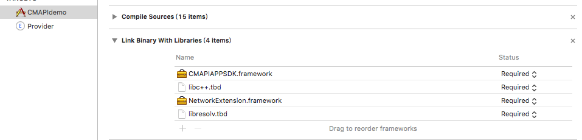

# **Weline iOS SDK**开发手册（VPN服务模式）


密级:秘密

* * *


# 关于本手册
- 版权声明

  **Weline.io**©2021版权所有，保留一切权力。本文件中出现的任何文字叙述、文档格式、插图、照片、方法、过程等内容，除另有特别注明，版权均属**Weline.io**所有，受到有关产权及版权法保护。未经**Weline.io**书面许可不得擅自拷贝、传播、复制、泄露或复写本文档的全部或部分内容。

- 信息更新

  本文档仅用于为NDA用户提供信息，并且随时可由**Weline.io**更改或撤回。

- 免责条款

  根据适用法律的许可范围，**Weline.io**按“原样”提供本文档而不承担任何形式的担保，包括（但不限于）任何隐含的适销性、特殊目的适用性或无侵害性。在任何情况下，**Weline.io**都不会对最终用户或任何第三方因根据说明文档使用SDK/后台接口造成的任何直接或间接损失或损坏负责，即使**Weline.io**明确得知这些损失或损坏，这些损坏包括（但不限于）利润损失、业务中断、信誉或数据丢失。

- 阅读对象

  本文的读者对象为和**Weline.io**签署了NDA（保密协议）的第三方厂商的研发人员。

- 密级
	
	本文的密级为秘密，禁止向非NDA公司或个人开放此文件。

* * *
# 目录

[TOC]

* * *
日期 | 版本 | 备注                                         
---|---|---
2018/12/29|v1.0.2|完成初稿
2019/09/05|v1.0.3|完成初稿
2019/01/03|v1.0.4|修改接口（添加同步方式）
2020/04/10|v1.0.5|添加DLT配置项接口
2020/09/21|v1.0.6|添加接入指南以及接入流程
2020/11/17|v1.0.7|添加获取短信验证码接口以及合作商账号验证接口
2020/12/01|v1.0.8|添加设置日志文件存放路径接口，以及设置日志级别接口
2020/05/17|v2.0.0|调整文档格式和描述


## 1.概要

​		此文档描述了第三方厂商集成虚拟网时，在iOS平台上所使用的Weline.io SDK，其目的是让第三方厂商的研发人员能快速将虚拟网功能嵌入到第三方应用程序中。

​		此文档适合公司内部和签署了NDA的第三方研发人员阅读。

## 2.系统需求

​		运行的目标系统要求iOS 9.0以上(含iOS 9.0)，iOS 9.0以下的系统不提供技术支持。

## 3.准备工作

在使用Weline.io SDK之前，请联系 Weline.io Inc. 获取SDK使用授权，取得授权后，将得到一个 AppId、PartnerId。

​	随本文档一起分发的Weline.io SDK包，包括以下内容：

- CMAPIAPPSDK.framework
- CMAPISDK.framework

## 4.接入指南

SDK的接入分为两部分：

- 主程序部分，使用CMAPIAPPSDK与Provider通信

- PacketTunnelProvider部分，使用CMAPISDK SDK 建立隧道，并处理主程序发起的数据请求


注：需配置Network Extension权限。Network Extension不同于其他权限，无法在Xcode的compalities中一键启用，需要在Apple Developer中心手动申请profile。你需要同时为主程序和Provider创建profile.如下图所示：


## 5.接入流程

### 5.1. 主程序部分

#### 5.1.1.工程配置

- 创建Provider Target

  创建工程之后,再创建一个Provider Target 如下图（由于未知原因苹果在mac OS 10.12中删除了这个文件，因此我们需要从10.11系统中提取或下载。安装NEProviderTargetTemplates.pkg）。创建完成之后，会生成PacketTunnelProvider类，此类的详细操作请参考4.2.Provider部分。

  

- 开启Network Extensions权限

  ​	选中主程序TARGETS，点击Capabilities，开启Network Extensions开关。Network Extensions 勾选 App Proxy、Content Filter、Packet Tunnel。如下图：

  

- 导入Framework、添加依赖库

  ​	选中主程序TARGETS，点击Build Phases，在Link Binary With Libraries中导入CMAPIAPPSDK.framework、NetworkExtension.framework，以及添加所需的依赖库libc++.tdb、libresolv.tdb，如下图所示：

  

#### 5.1.2.开发流程

步骤一.引入相关头文件

```objc
#import <CMAPIAPPSDK/cmapiApp.h>
```

步骤二.初始化数据

​	进入APP后，需首先配置以下数据。

​	（1）设置kVPNId，此属性是设置VPN配置的显示名称，用作系统的VPN设置UI中VPN配置的显示名称。

​		代码示例：

```objc
[cmapiApp sharedInstance].kVPNId = @"CMAPIs SDVN";
```

​		界面显示如下：

​		

​	（2）设置kProviderBundleid，此属性是用于指定在此配置中应使用哪个隧道提供程序扩展。将前面创建的provider target的Bundle Identifier设置给kProviderBundleid即可。

​		代码示例如下：

```objc
[cmapiApp sharedInstance].kProviderBundleid = @"net.memenet.CMAPIdemo.provider";
```

​	（3）设置kServerAddr，此属性是用于设置隧道服务器地址，填写可用的域名地址即可。

​		代码示例如下：

```objc
[cmapiApp sharedInstance].kServerAddr = @"xxxxxx";
```

步骤三.添加VPN连接状态的监听

​	在登录前，需设置VPN连接状态的监听，通过设置代理的方法通知。APP根据返回的状态做相应的操作。

​	代码示例如下：

```objc
//设置代理
[cmapiApp sharedInstance].statusDelegate = self;

//代理方法
- (void)statusChange:(CONNECTION_STAT)status Dr:(int)dr {
    if (CCS_CONNECTING == status) {	//正在连接
        
    }else if (CCS_CONNECTED == status) {	//已连接
        
    }else if(CCS_DISCONNECTING == status) {	//正在登出
        
    }else if(CCS_DISCONNECTED == status) {	//已登出
        
    }
    
}
```

步骤四.检测系统VPN是否被其它应用连接（此步骤可选）

​	进入APP后，先调用检测系统VPN当前连接状态的方法，再根据需求作相应的操作。

​	注：此步骤可根据APP需求使用，如果不管系统VPN是否被占用，则不需要使用此方法。

​	代码示例如下：

```objc
[[cmapiApp sharedInstance] CheckOtherVPNIsConnected:^(BOOL result) {
    if (!result) {	//系统VPN未被占用
    }else {	//系统VPN被占用
    }
}];
```

步骤五.VPN配置授权、创建/获取当前APP的VPN配置

​	进入APP后，必须使用createSessionWithCompletionHandler授权VPN配置，并且创建/获取当前APP的VPN配置。

​	注：

​	（1）APP第一次启动时，调用此方法，会弹出VPN授权框，用户必须允许才可执行下面的操作。用户同意授权后，会创建当前APP的VPN配置，在系统VPN设置中可查看到配置的VPN信息；


​	（2）当系统VPN被其他APP占用时，使用此方法，可以切换当前APP的VPN（此时VPN的状态是未连接，需执行login方法才能连接上）；

​	（3）在执行login方法前，必须调用此方法，因为如果VPN配置被其它VPN占用，需使用此方法，切换到当前APP的VPN，再执行login方法。

​	代码示例如下：

```objc
[[cmapiApp sharedInstance] createSessionWithCompletionHandler:^(BOOL result) {
        if (result) {	
          //已授权VPN配置
        }else {
          //未授权VPN配置，需提示用户授权，并重新调用此方法，弹出VPN授权框
        }
}];
```

步骤六.获取基本信息

​	通过使用getBaseInfo获取基本信息，通过使用此方法获取的信息，可以实现以下功能：

​	（1）展示历史登录账号；

​	（2）展示最后一次成功登录的账号；

​	（3）如果需要APP启动后实现自动登录，则需要在执行createSessionWithCompletionHandler方法后，获取基本信息（getBaseInfo），拿到最后一次登录的账号，以及当前虚拟网的状态。

​	代码示例如下：

```objc
[[cmapiApp sharedInstance] createSessionWithCompletionHandler:^(BOOL result) {
        if (result) {
            NSDictionary *result = [[cmapiApp sharedInstance] getBaseInfo:nil];
            if (result) {
                NSDictionary *informationDic = [result objectForKey:@"information"];
                NSString *current_account = [informationDic objectForKey:@"account"];	//最后一次成功登录的账号
                NSDictionary *history_accounts = [result objectForKey:@"users"];	//历史账号
                int status = [[informationDic objectForKey:@"status"] intValue];
                if (status == CCS_CONNECTED) {

                }else {
                  //如果current_account不为空，并且status == CCS_DISCONNECTED，可以使用current_account实现自动登录
                    if (![current_account isEqualToString:@""] && status == CCS_DISCONNECTED) {
                        [[cmapiApp sharedInstance] loginWithAccount:current_account password:@""];
                    }
                }
            }
        }
    }];
```

步骤七.登录

​	使用login方法登录虚拟网，登录方式有五种，接口的使用说明请参考7.4.

​	注：

​	（1）需在VPN状态为未连接时，才可以执行login；

​	（2）需检测VPN是否被其它APP占用，如果被占用，不可以直接使用login登录，需使用createSessionWithCompletionHandler方法，切换到当前APP的VPN，再执行login方法。

​	代码示例如下：

```objc
[[cmapiApp sharedInstance] CheckOtherVPNIsConnected:^(BOOL result) {
        if (!result) {	//VPN未被占用
            [[cmapiApp sharedInstance] loginWithAccount:account password:password];
        }else {	//VPN被占用
          //如果被占用，但想抢回来时，则可以使用createSessionWithCompletionHandler切换到当前APP的VPN，或者可以弹出提示框，让用户选择是否切换到当前APP的VPN
          [[cmapiApp sharedInstance] createSessionWithCompletionHandler:^(BOOL result) {
            if (result) {
              [[cmapiApp sharedInstance] loginWithAccount:account password:password];
            }
          }];
    }];
```

步骤八.登出
	使用stopLogin方法取消正在进行连接或停止已经连接的登录操作。

​	注：此方法需在登录状态为CCS_CONNECTING或CCS_CONNECTED时执行。

​	代码示例如下：

```objc
[[cmapiApp sharedInstance] stopLogin];
```

### 5.2. PacketTunnelProvider部分

#### 5.2.1.工程配置

- 开启Network Extensions权限

  ​	选中Provider TARGETS，点击Capabilities，开启Network Extensions开关。Network Extensions 勾选 App Proxy、Content Filter、Packet Tunnel。如下图：

  

- 导入Framework、添加依赖库

  ​	选中主程序TARGETS，点击Build Phases，在Link Binary With Libraries中导入CMAPISDK.framework、NetworkExtension.framework，以及添加所需的依赖库libc++.tdb、libresolv.tdb，如下图所示：

#### 5.2.2.开发流程

​	在创建Provider Target工程里，会自动生成PacketTunnelProvider类，在此类中有些方法是不需要用的，可删掉。

步骤一.引入相关头文件

```objc
#import <CMAPISDK/cmapi.h>
```

步骤二.初始化

（1）定义cmapi属性

```objc
@interface PacketTunnelProvider ()
@property (nonatomic, strong)  cmapi * cmapi;
@end
```

（2）初始化

```objc
- (instancetype) init {
    self = [super init];
    if (self) {
        if (nil == _cmapi) {
             //初始化并设置AppID 、PartnerID、DeviceClass（此三个值需向Weline.io Inc. 申请）
            _cmapi = [[cmapi alloc]initLibraryWithAppID:AppID withPartnerID:PartnerID withDevClass:DC_COMMON_IOS AndProvider:self AndDnsDivert:true];
            //注册通知（用于通知当前隧道被其它APP抢占）
            [self registUserNotificationCenter];
          	//设置日志级别（一般设置5即可）
          	[_cmapi setOutputLogLevel:5];
        }
    }
    return self;
}

```

步骤三.设置登录帐号、登录密码、网络环境、开始通道建立

注：在主程序使用login方法后，会将登录帐号、登录密码等信息，通过此方法传入到provider层，此处的数据不需要管，按照下面的方法实现即可。

```objc
- (void)startTunnelWithOptions:(NSDictionary *)options completionHandler:(void (^)(NSError *))completionHandler
{
    
    if (nil != options) {
        //通过UI进程传递的帐号数据建立通道
        [_cmapi startConnectionWithOptions:options completionHandler:completionHandler];
    }else{
        //当已成功登录过之后，在系统设置中打开VPN开关，则会以最后一次登录的帐号通过此方法建立通道
        [_cmapi startConnectionWithOptions:nil completionHandler:completionHandler];
    }
}
```

步骤四.通用接口，与主程序进行数据交互

```objc
- (void)handleAppMessage:(NSData *)messageData completionHandler:(void (^)(NSData *))completionHandler
{
    [_cmapi processAppMessage:messageData completion:completionHandler];
}
```

步骤五.调用停止通道方法

注：由于VPN隧道有可能会被其它VPN抢占，所以可以添加通知的方式告知用户。

```objc
- (void)stopTunnelWithReason:(NEProviderStopReason)reason completionHandler:(void (^)(void))completionHandler
{
    [_cmapi stopTunnel:completionHandler];
    if (reason == NEProviderStopReasonSuperceded || reason == NEProviderStopReasonConfigurationDisabled) {
				//VPN被抢占，当前VPN已断开连接
        [self createLocationNotification];
    }
}
```

步骤六.创建推送通知

（1）注册推送通知

```objc
- (void)registUserNotificationCenter {
    //注册通知
    UNUserNotificationCenter *center = [UNUserNotificationCenter currentNotificationCenter];
    //    center.delegate = self;
    [center requestAuthorizationWithOptions:(UNAuthorizationOptionBadge | UNAuthorizationOptionSound | UNAuthorizationOptionAlert) completionHandler:^(BOOL granted, NSError * _Nullable error) {
        if (granted) {
            NSLog(@"request authorization successed!");
        }
    }];
    //之前注册推送服务，用户点击了同意还是不同意，以及用户之后又做了怎样的更改我们都无从得知，现在 apple 开放了这个 API，我们可以直接获取到用户的设定信息了。
    [center getNotificationSettingsWithCompletionHandler:^(UNNotificationSettings * _Nonnull settings) {
        NSLog(@"%@",settings);
    }];
}
```

（2）创建推送通知

```objc
-(void)createLocationNotification {
    [self locationNotifcation];
}

-(void)locationNotifcation{
    UNUserNotificationCenter *center = [UNUserNotificationCenter currentNotificationCenter];
    //请求获取通知权限（角标，声音，弹框）
    [center requestAuthorizationWithOptions:(UNAuthorizationOptionBadge | UNAuthorizationOptionSound | UNAuthorizationOptionAlert) completionHandler:^(BOOL granted, NSError * _Nullable error) {
        if (granted) {
            //获取用户是否同意开启通知
            NSLog(@"request authorization successed!");
        }
    }];
    
    //第二步：新建通知内容对象
    
    UNMutableNotificationContent *umnot =[[UNMutableNotificationContent alloc] init];
    umnot.title = @"";
    umnot.subtitle = @"";
    umnot.body = @"因为系统VPN已被其它APP占用，当前链路已断开";
    umnot.badge = @1;
    //    UNNotificationSound *sound = [UNNotificationSound soundNamed:@"caodi.m4a"];
    //    umnot.sound = sound;
    
    //第三步：通知触发机制。（重复提醒，时间间隔要大于60s）
    UNTimeIntervalNotificationTrigger *trigger1 = [UNTimeIntervalNotificationTrigger triggerWithTimeInterval:1 repeats:NO];
    
    //第四步：创建UNNotificationRequest通知请求对象
    NSString *requertIdentifier = @"RequestIdentifier";
    UNNotificationRequest *request = [UNNotificationRequest requestWithIdentifier:requertIdentifier content:umnot trigger:trigger1];
    
    //第五步：将通知加到通知中心
    [[UNUserNotificationCenter currentNotificationCenter] addNotificationRequest:request withCompletionHandler:^(NSError * _Nullable error) {
        NSLog(@"Error:%@",error);
        
    }];
  
}
```

## 6. CMAPISDK接口说明

### 6.1.初始化

此接口需在 NEPacketTunnelProvider 的- (instancetype) init 方法中使用

```objc
// appId : 产品ID，针对每一款产品授权分配
// partnerID : 合作伙伴ID，由Weline.io后台统一授权分配
// devClass : 设备类型编码，用于区分同一个产品ID下的多个类型的设备
// provider : NEPacketTunnelProvider
// dnsDivert : 如果使用虚拟网络的域名，则需要设置DNS,否则反之

-(id) initLibraryWithAppID:(NSString *)appId withPartnerID:(NSString *)partnerID withDevClass:(NSInteger)devClass AndProvider:(NEPacketTunnelProvider *)provider AndDnsDivert:(BOOL)dnsDivert;
```

### 6.2.DNS过滤设置

此接口需在 NEPacketTunnelProvider 的- (instancetype) init 方法中使用

```objc
//nagation：false就是规则匹配上的走虚拟网DNS解析，未匹配上的走真实DNS解析
//             true 就是规则匹配上的走真实DNS解析，未匹配上的走虚拟网DNS解析
//items：需过渡的域名，如：@["*.cmhk.com"]
- (void)setPacOptionNagation:(BOOL)nagation items:(NSArray *)items;
```

### 6.3.设置AS地址和端口

此接口需在 NEPacketTunnelProvider 的- (instancetype) init 方法中使用

```objc
//asHost：AS地址
//asPort：AS端口
- (void)setAsHost:(NSString *)asHost withAsPort:(unsigned short)asPort
```

### 6.4.通道连接

此接口需在 NEPacketTunnelProvider 的- (void)startTunnelWithOptions:(nullable NSDictionary<NSString *,NSObject *> *)options completionHandler:(void (^)(NSError * __nullable error))completionHandler方法中使用

```objc
//连接方式有两种：
//方法一：此方法连接会有数据
// options : 传入startTunnelWithOptions方法中的options
// completionHandler : 传入startTunnelWithOptions方法中的completionHandler

- (void)startConnectionWithOptions:(NSDictionary *)options completionHandler:(void (^)(NSError *  error))completionHandler;

//方法二：只显示VPN图标，其它数据都没有（仅用来测试，属于假连接，可用来给苹果审核的账号使用）
- (void)fakeConnectionWithCompletionhandler:(void (^)(NSError *  error))completionHandler;
```

### 6.5.停止通道连接

此接口需在 NEPacketTunnelProvider 的- (void)stopTunnelWithReason:(NEProviderStopReason)reason completionHandler:(void (^)(void))completionHandler方法中使用

```objc
// completionHandler : 传入stopTunnelWithReason方法中的completionHandler

-(void)stopTunnel:(void (^)(void))completionHandler;
```

### 6.6.数据交互

此接口需在 NEPacketTunnelProvider 的- (void)handleAppMessage:(NSData *)messageData completionHandler:(void (^)(NSData *))completionHandler方法中使用

```objc
// data : 传入handleAppMessage方法中的messageData
// completionHandler : 传入handleAppMessage方法中的completionHandler

- (void) processAppMessage:(NSData *)data completion:(void (^)(NSData *))completionHandler;
```

### 6.7.设置日志级别

此接口需在 NEPacketTunnelProvider 的- (instancetype) init 方法中使用，并且是在cmapi init之后再调用。

```objc
-(void)setOutputLogLevel:(int)logLevel;
```

- 说明:


```js
（1）此接口需要与CMAPIAPPSDK.framework中的- (void)setLogPath:(NSString *)path;接口配合使用，因为如果不设置日志文件存放路径，日志将无法输出；
（2）如果不需要查看日志时，请不要使用此接口；
（3）如无特殊情况，日志级别设置为5即可。
```

## 7. CMAPIAPPSDK接口说明

主程序与Provider的数据交互通过CMAPIAPPSDK.framewowrk通信。

注：获取数据的接口，可以通过同步或异步的方式获取，如果使用异步则无返回值。如：

- 同步方式：

	NSDictionary *result = [[cmapiApp sharedInstance] getBaseInfo:nil];
- 异步方式：

   [[cmapiApp sharedInstance] getBaseInfo:^(NSDictionary *result) {
        
   }];

### 7.1.  设置VPNID、AppGroupID、Provider进程BundleID、服务器地址

```objc
[cmapiApp sharedInstance].kVPNId = @"xxxx SDVN";
[cmapiApp sharedInstance].kProviderBundleid = @"xxxxxx";
[cmapiApp sharedInstance].kServerAddr = @"xxxxxx";
```
- 说明:
参数为设置网络扩展必须要设置的参数。

### 7.2.  检测系统vpn是否已被其它应用连接
此接口建议在createSessionWithCompletionHandler和login之前，先执行此方法，当收到completionHandler返回值之后，如果返回NO，再执行createSessionWithCompletionHandler或login，如果返回YES，则不再创建VPN，且不能login

```objc
- (void)CheckOtherVPNIsConnected:(void (^)(BOOL result)) completionHandler;

// result : BOOL  YES（表示系统VPN已连接） NO（表示系统VPN未连接）
```

### 7.3.  创建连接会话并获取是否授权
此接口只有在登录状态为CS_DISCONNECTED时有效

```objc
- (void) createSessionWithCompletionHandler:(void (^)(BOOL result)) completionHandler;

// result : BOOL  YES表示用户已授权开启网络扩展服务，NO表示未授权
```

### 7.4. 登录

此操作是在createSessionWithCompletionHandler之后，并在登录状态为CCS_DISCONNECTED时执行

#### 7.4.1.登录

注：此接口根据辅助验证模式以及认证模式传入相关的参数

```objc
//account ：用户名
//password ：密码
//thirdCode ：第三方认证使用的code，代替账号密码使用（无则传空）
//auxAuthMode ： 辅助验证模式（AAM_NONE：不需要辅助验证，AAM_SMS：使用短信口令进行辅助验证）
//auxAuthValue ： 短信验证码
//authMethod: 认证模式
- (void) loginWithAccount:(NSString *)account password:(NSString *)password thirdCode:(NSString *)thirdCode auxAuthMode:(AUX_AUTHENTICATE_MODE)auxAuthMode auxAuthValue:(NSString *)auxAuthValue authMethod:(AUTH_METHOD)authMethod
```
#### 7.4.2.静态密码登录

注：您可根据用户输入的用户名和密码，调用此方法进行用户名密码登录。

```objc
//account ：用户名
//password ：密码
- (void) loginWithAccount:(NSString *)account password:(NSString *)password;
```

#### 7.4.3.短信口令登录

注：如果你需要使用Weline.io平台的短信验证码登录功能，可咨询Weline.io Inc.相关工作人员，开通短信验证功能。您可以选择使用我们提供的短信验证服务，也可以将您自己实现的短信验证服务对接过来。发送短信时需要配置短信服务接口的地址Host 、端口号Post 、认证模式。

（1）获取短信验证码

```objc
 	//account : 登录的用户名
 	//host ：短信服务接口的地址
 	//port ：短信服务接口的端口
 	//authmode ：短信服务接口的认证模式
  - (RET_SMS_STAT)getCodeWithAccount:(NSString *)account withHost:(NSString *)host withPort:(NSString *)port withAuthmode:(int)authmode;
```

- RET_SMS_STAT定义:

  ```js
  typedef enum{
      RET_SUCCESS = 0,      // 处理成功
      ERR_USER_NOT_EXIST = 101,   // 用户不存在
      ERR_SERVER_ERROR     =  102,   // 服务器内部错误
      ERR_SEND_SMS_FAILED   = 103,    // 发送短信失败
      ERR_NOT_BIND_PHONE    = 104,   // 用户未绑定手机
      ERR_INVALID_REQUEST   = 105,  // 无效请求
      ERR_INVALID_PASSWORD =  106,    // 密码校验错误
      ERR_FREQUENTLY_REQ    = 107,    // 申请过于频繁,稍后再尝试
      ERR_INVALID_PASSWORD_TOO_MUCH = 108,  //密码错误，申请错误超过3次
  }RET_SMS_STAT;
  ```

- RET_SMS_STAT说明:

  | 定义                          | 值   | 说明                      |
  | ----------------------------- | ---- | ------------------------- |
  | RET_SUCCESS                   | 0    | 处理成功                  |
  | ERR_USER_NOT_EXIST            | 101  | 用户不存在                |
  | ERR_SERVER_ERROR              | 102  | 服务器内部错误            |
  | ERR_SEND_SMS_FAILED           | 103  | 发送短信失败              |
  | ERR_NOT_BIND_PHONE            | 104  | 用户未绑定手机            |
  | ERR_INVALID_REQUEST           | 105  | 无效请求                  |
  | ERR_INVALID_PASSWORD          | 106  | 密码校验错误              |
  | ERR_FREQUENTLY_REQ            | 107  | 申请过于频繁,稍后再尝试   |
  | ERR_INVALID_PASSWORD_TOO_MUCH | 108  | 密码错误，申请错误超过3次 |

（2）短信口令登录

```objc
//account ：用户名
//password ：短信口令
- (void)loginBySmsWithAccount:(NSString *)account smsCode:(NSString *)smsCode;
```

#### 7.4.4.token登录

注：系统支持由第三方平台提供的Token进行登录。

（1）获取到token后，可调用loginByTokenWithAccount方法进行登录

```objc
//account ：用户名
//token ：token实现一键登录
- (void)loginByTokenWithAccount:(NSString *)account token:(NSString *)token;
```

（2）合作商账号验证

​		系统支持统一第三方平台的账号验证，并返回第三方指定信息。（可选，且需在登录虚拟网后再执行）

```objc
//generateDomain : 生成Token的域名
//verifyDomain : 验证Token的域名
//appkey : 申请的appKey
//eAppid : 申请的eAPPID
//appid : 申请的appid
//partnerid ：申请的partnerid
- (void)verifyPartnerAccountWithGenerateDomain:(NSString *)generateDomain verifyDomian:(NSString *)verifyDomain appKey:(NSString *)appkey eAppid:(NSString *)eAppid appid:(NSString *)appid partnerid:(NSString *)partnerid completion:(void (^)(NSDictionary *dict,NSError *error)) completion;
```

- 说明:

```js
（1）域名参数，可以带端口号，如xxx.xx.xx:8080;如无特殊情况，生成Token的域名端口为8445，验证Token的端口为9443。
（2）请求失败时，具体错误信息，可以查看dict中的errMsg返回的内容或者error内容。
```

#### 7.4.5.假连接（只显示VPN图标的登录方式）

```objc
- (void)fakeLogin;
```

### 7.5. 登出
- 取消正在进行连接或停止已经连接的登录操作

```objc
- (void)stopLogin;
```
- 说明:

```js
调用登出方法之后，在 - (void) statusChange:(CONNECTION_STAT)status Dr:(int)dr; 代理方法中，当status为CCS_DISCONNECTED时，表示登出成功
```
### 7.6. 获取当前VPN连接状态

```objc
//返回值（CONNECTION_STAT）：VPN连接状态值

- (CONNECTION_STAT)getCurrentStatus;
```
- 说明:

```js
此接口需在createSessionWithCompletionHandler后使用
```

### 7.7. 获取虚拟网络登录状态信息
此接口一般用于登入成功之后获取虚拟隧道延时、速度、流量等信息

```objc
- (NSDictionary *)getStatusInfo:(void (^)(NSDictionary * result)) completion;
```

- 登录状态

```js
typedef enum
{
    CCS_UNKNOWN = 0, //未知
    CCS_PREPARE,     //已经就绪（内部初始化使用）
    CCS_CONNECTING,  //正在登入
    CCS_CONNECTED,   //登入状态，虚网隧道已激活
    CCS_DISCONNECTED,//登出状态，虚网隧道未激活
    CCS_AUTHTICATED, //认证完成，虚网隧道未激活
    CCS_UNACTIVE, // 设备未激活，用于非终端类型设备
    CCS_ACTIVING, // 设备激活中
    CCS_DISCONNECTING,  // 正在断开连接
    CCS_WAIT_RECONNECTING, //正在等待重连
} CONNECTION_STAT;

```
- 登录状态说明

  | 登录状态              | 值   | 状态说明                                                     |
  | --------------------- | ---- | ------------------------------------------------------------ |
  | CCS_UNKNOWN           | 0    | 未知状态                                                     |
  | CCS_PREPARE           | 1    | 程序内部初始化使用                                           |
  | CCS_CONNECTING        | 2    | 正在登入                                                     |
  | CCS_CONNECTED         | 3    | 登入成功，该状态下虚拟隧道已激活，可以获取到所有与虚网相关信息和状态信息 |
  | CCS_DISCONNECTED      | 4    | 登出成功，该状态下虚拟隧道断开，虚网不可用，只能获取少量信息(如:历史账号等) |
  | CCS_AUTHTICATED       | 5    | 认证完成，虚网隧道未激活                                     |
  | CCS_UNACTIVE          | 6    | 设备未激活，用于非终端类型设备                               |
  | CCS_ACTIVING          | 7    | 设备激活中                                                   |
  | CCS_DISCONNECTING     | 8    | 正在断开连接                                                 |
  | CCS_WAIT_RECONNECTING | 9    | 正在等待重连                                                 |


- 设备处于登出状态的原因定义

```js
typedef enum
{
    DR_UNSET = 0,
    DR_BY_USER,     //1.通过调用登出接口 2.设备开机，但未设置自动登入
    DR_MISVERSION,      //版本太低(被限制登录)
    DR_NETWORK_TIMEOUT,     //与后台服务器的网络连接中断(如后台升级)
    DR_MISSING_INFO,        //未配置过任何账号信息或者设备账号信息丢失
    DR_INVALID_USER,    //无效的用户名
    DR_INVALID_PASS,    //无效的密码，或者口令
    DR_DEVICE_DELETED,    //设备被管理端删除
    DR_DEVICE_ONLINE,    //已有一台该SN的设备在线
    DR_DEVICE_DISABLED,    //设备被限制登入
    DR_MAX_DEVICE=10,    //设备数量超限
    DR_NO_NETWORK,    //无可用的虚拟网络（一般不会发生）
    DR_KO_USER_REMOVED,    //用户被某个虚拟网络所有者踢出
    DR_KO_DEVICE_REMOVED,    //设备被某个虚拟网络所有者踢出
    DR_KO_DEVICE_DELETED,    //设备被某个虚拟网络所有者踢出
    DR_TUN_DEVICE,    //系统无可用tun设备，或者tun0设备其他程序占用
    DR_DTYPE_CHANGED,    //设备被升级为超级节点(特定设备使用)
    DR_NETWORK_UNUSABLE,    //无可用互联网（如设备网线被拔）
    DR_USER_RELOGIN,    //用户执行了重新登入
    DR_ALGO_TYPE_CHANGED,    //隧道算法被更改
    DR_AUX_AUTH_DISMATCH=20,    //认证模式不匹配
    DR_INVALID_AUTHORIZATION,    //无效的授权
    DR_PROTOCOL,               //协议错误
    DR_NETWORK_BROKEN,         //网络中断
    DR_KICKOUT_BY_AS,          //强制下线
    DR_INVALID_SMS,         //短信口令已过期，需要重新申请短信口令
    DR_INVALID_TICKET,      //无效的ticket
    DR_TRY_TOO_MANY_TIMES,      //登录尝试次数过于频繁
    DR_CALL_THIRD_API_FAIL,     //与第三方接口对接失败
    DR_INVALID_CODE = 30,   //无效的第三方code
    DR_WAKE_UP,     //系统休眠，导致网络中断，从休眠唤醒后将自动重连
    DR_VPN_UNAUTHORIZED=2018,   //VPN未授权
    DR_VPN_SERVER_CONNECT_FAIL=2019,   //VPN服务开启失败
} DISCONNECT_REASON;
```

- 设备处于登出状态的原因说明

  | 登出状态错误码             | 值   | 错误码说明                                               |
  | -------------------------- | ---- | -------------------------------------------------------- |
  | DR_UNSET                   | 0    | 未知错误                                                 |
  | DR_BY_USER                 | 1    | 1.通过调用登出接口 2.设备开机，但未设置自动登入          |
  | DR_MISVERSION              | 2    | 版本太低(被限制登录)                                     |
  | DR_NETWORK                 | 3    | 与后台服务器的网络连接中断(如后台升级)                   |
  | DR_MISSING_INFO            | 4    | 未配置过任何账号信息或者设备账号信息丢失                 |
  | DR_INVALID_USER            | 5    | 无效的用户名                                             |
  | DR_INVALID_PASS            | 6    | 无效的密码，或者口令                                     |
  | DR_DEVICE_DELETED          | 7    | 设备被管理端删除                                         |
  | DR_DEVICE_ONLINE           | 8    | 已有一台该SN的设备在线                                   |
  | DR_DEVICE_DISABLED         | 9    | 设备被限制登入                                           |
  | DR_MAX_DEVICE              | 10   | 设备数量超限                                             |
  | DR_NO_NETWORK              | 11   | 无可用的虚拟网络（一般不会发生）                         |
  | DR_KO_USER_REMOVED         | 12   | 用户被某个虚拟网络管理者踢出                             |
  | DR_KO_DEVICE_REMOVED       | 13   | 设备被某个虚拟网络管理者踢出                             |
  | DR_KO_DEVICE_DELETED       | 14   | 设备被某个虚拟网络管理者删除                             |
  | DR_TUN_DEVICE              | 15   | 系统无可用tun设备，或者tun0设备其他程序占用(限Linux平台) |
  | DR_DTYPE_CHANGED           | 16   | 设备被升级为超级节点(限Linux平台)                        |
  | DR_NETWORK_UNUSABLE        | 17   | 无可用互联网（如设备网线被拔）                           |
  | DR_USER_RELOGIN            | 18   | 用户执行了重新登入                                       |
  | DR_ALGO_TYPE_CHANGED       | 19   | 隧道算法被更改                                           |
  | DR_AUX_AUTH_DISMATCH       | 20   | 认证模式不匹配                                           |
  | DR_INVALID_AUTHORIZATION   | 21   | 无效的授权，appid和partnerid无效                         |
  | DR_PROTOCOL                | 22   | 协议错误                                                 |
  | DR_NETWORK_BROKEN          | 23   | 网络中断                                                 |
  | DR_KICKOUT_BY_AS           | 24   | 被踢下线                                                 |
  | DR_INVALID_SMS             | 25   | 短信口令已过期，需要重新申请短信口令                     |
  | DR_INVALID_TICKET          | 26   | 无效的ticket                                             |
  | DR_TRY_TOO_MANY_TIMES      | 27   | 登录尝试次数过于频繁                                     |
  | DR_INVALID_DEVICE_CLASS    | 28   | 无效的设备类型                                           |
  | DR_CALL_THIRD_API_FAIL     | 29   | 与第三方接口对接失败                                     |
  | DR_INVALID_CODE            | 30   | 无效的第三方code                                         |
  | DR_WAKE_UP                 | 31   | 系统休眠，导致网络中断，从休眠唤醒后将自动重连           |
  | DR_VPN_UNAUTHORIZED        | 2018 | VPN未授权                                                |
  | DR_VPN_SERVER_CONNECT_FAIL | 2019 | VPN服务开启失败                                          |

- 返回字段

```js
{
	 "result": CE_SUCC,   //返回结果
	 "status": CCS_XXX,  // 当前登录状态，定义见CM_CONNECTION_STAT
	 "disconnect_reason": xxx,   // 连接断开原因 (CCS_DISCONNECTED状态有值)，定义见DISCONNECT_REASON
	 "data": {
		 "duration": xx,       // seconds from established(登录时长)
		 "network_status": {   // if CCS_CONNECTED
		 "rx_bytes": "xxxx", // uint64 converted to string
		 "rx_speed": xxx,    // uint rx speed (bytes)
		 "tx_bytes": "xxxx", // uint64 converted to string
		 "tx_speed": xxx,    // uint tx speed (bytes)
		 "latency" : xxx     // 网络延时 单位 ms
	 }
} 
```
### 7.8. 获取基本信息

```objc
- (NSDictionary *)getBaseInfo:(void (^)(NSDictionary *result)) completion;
```
- 返回字段

```js
{
	 "result": CE_SUCC,       //返回结果
	 "users": [              // 曾经成功登录过的账号列表 (所有状态有值)
	     {"account": "xxx" }  // 账号
	 ],
	 "information": {
	     "version": "x.x.x.x",  // 当前版本 (所有状态有值)
	     "status": CCS_XXX,  // 当前状态(所有状态有值)，参见上面的CM_CONNECTION_STAT定义
	     "disconnect_reason": xxx,   // 连接断开原因(CCS_DISCONNECTED状态有值)，参见上面的DISCONNECT_REASON定义
	     "account" : "xxx",  // 最后一次成功登录的账号 (所有状态有值，为登录过任何账号时为空)
	     "uid": "xxx",       // 账号对应的用户唯一编号 (CCS_CONNECTED状态有值)
	     "device_id": "xxx",  // 当前设备的唯一编号 (成功登录后，所有状态有值)
	     "domain" : "xxx",    // 当前设备的虚拟域名 (CCS_CONNECTED状态有值)
	     "ad_domain"; "xxx",  // 当前设备的虚拟AD域名 (CCS_CONNECTED状态有值)
	     "vip" : "x.x.x.x",    // 当前的虚拟IP (CCS_CONNECTED状态有值)
	     "vmask" : "x.x.x.x",  // 虚拟掩码 (CCS_CONNECTED状态有值)
	     "priv_ip": "x.x.x.x",  // 设备的内网地址 (CCS_CONNECTED状态有值)
	     "priv_port": xxx,      // 内网私有端口  (CCS_CONNECTED状态有值)
	     "timestamp" : xxx,  // 建立连接时的时间戳 (CCS_CONNECTED状态有值)
	     "ticket" : "xxx",   // 当前登录的票据 (CCS_CONNECTED状态有值)
	     "netid" : "xxx",    // 当前所在网络的Id (CCS_CONNECTED状态有值)
	     "snid" : "xxx",       //当前选择的SN Id (CCS_CONNECTED状态有值)
	     "as_host" : "xxxx"   //AS域名(所有状态有值)
	},
	"option" : {
		 "autologin" : true | false,    // 程序启动时，自动登录 (所有状态有值)
		 "dlt": true | false,  // DLT设置 (所有状态有值)
		 "st": true | false, // ST设置 (所有状态有值)
		 "snmode": true | false  // 设备当前是否为SN (CCS_CONNECTED状态有值)
		 "vip_feature": xxx, // VIP_FEATURE 组合值
		 "algo_level": xxx,  // 算法等级设置 (所有状态有值)
		 "partner_feature": xxx, // 内部使用
	}
	"api_gw_info": {  //应用网关域名
		 "domain": "xxxx"
	}
}
```
### 7.9. 获取网络信息列表
此接口在登录状态为CCS_CONNECTED时才有效

```objc
- (NSDictionary *)getNetworkList:(void (^)(NSDictionary * result)) completion;
```

- 返回字段

```js
{
	 "result" : CE_SUCC,
	 "netid": "xxx",    //当前的网络ID
	 "data" : [
		 {
			 "id" : "xxx",    //网络 ID
			 "name" : "xxx",  //网络名称
			 "owner" : "xxx"  //网络属主帐号
		 }
	 ]
}
```
### 7.10. 获取当前网络所有设备的列表
此接口在登录状态为CCS_CONNECTED时才有效

```objc
- (NSDictionary *)getDeviceList:(void (^)(NSDictionary * result)) completion;
```

- 设备种类

```js
typedef NS_ENUM(int, DeviceType)
{
    DT_UNKOWN = 0,
    DT_DEVICE = 1,	//普通设备
    DT_SMARTNODE = 50,	//节点设备
};
```

- 返回字段

```js
{
     "cmd" : CMC_GET_DEVICES,
     "devices": [  // 设备列表
         {
             "id": "xx", // Id
             "owner": "xxx", // 设备属主帐号
             "userid": "xxx", // User Id
             "domain": "xxx", // 设备域名
             "ad_domain": "xxx", // 设备AD域名
             "name": "xx", // 设备名称
             "device_class": xxx, // 设备类型
             "vip": "x.x.x.x",
             "pubip": "x.x.x.x",
             "ver": "x.x.x.x",
             "feature": xx,
             "dlt": {
                 "dlt_status": true|false,  //dlt 开关
                 "algo_level": xx,          //隧道算法，参见算法定义
                 "class": xx,
                 "peer_ip": "x.x.x.x",
                 "peer_port": xx
             }，
             "subnet": [
                { "net": "x.x.x.x", "mask": "x.x.x.x" }
             ]
         }
     ]
 }
```
### 7.11. 根据设备id来获取设备信息，只返回一个设备
此接口在登录状态为CCS_CONNECTED时才有效

```objc
//idStr ： 设备id

- (NSDictionary *)getDeviceByID:(NSString *)idStr completion:(void (^)(NSDictionary * result)) completion;
```

- 返回字段

```js
{
     "cmd" : CMC_GET_DEVICES,
     "devices": [  // 设备列表
         {
             "id": "xx", // Id
             "owner": "xxx", // 设备属主帐号
             "userid": "xxx", // User Id
             "domain": "xxx", // 设备域名
             "ad_domain": "xxx", // 设备AD域名
             "name": "xx", // 设备名称
             "device_class": xxx, // 设备类型
             "vip": "x.x.x.x",
             "pubip": "x.x.x.x",
             "ver": "x.x.x.x",
             "feature": xx,
             "dlt": {
                 "dlt_status": true|false,  //dlt 开关
                 "algo_level": xx,          //隧道算法，参见算法定义
                 "class": xx,
                 "peer_ip": "x.x.x.x",
                 "peer_port": xx
             }，
             "subnet": [
                { "net": "x.x.x.x", "mask": "x.x.x.x" }
             ]
         }
     ]
 }
```
### 7.12. 根据设备vip来获取设备信息，只返回一个设备
此接口在登录状态为CCS_CONNECTED时才有效

```objc
//ipStr ： 设备vip

- (NSDictionary *)getDeviceByIP:(NSString *)ipStr completion:(void (^)(NSDictionary * result)) completion;
```

- 返回字段

```js
{
     "cmd" : CMC_GET_DEVICES,
     "devices": [  // 设备列表
         {
             "id": "xx", // Id
             "owner": "xxx", // 设备属主帐号
             "userid": "xxx", // User Id
             "domain": "xxx", // 设备域名
             "ad_domain": "xxx", // 设备AD域名
             "name": "xx", // 设备名称
             "device_class": xxx, // 设备类型
             "vip": "x.x.x.x",
             "pubip": "x.x.x.x",
             "ver": "x.x.x.x",
             "feature": xx,
             "dlt": {
                 "dlt_status": true|false,  //dlt 开关
                 "algo_level": xx,          //隧道算法，参见算法定义
                 "class": xx,
                 "peer_ip": "x.x.x.x",
                 "peer_port": xx
             }，
             "subnet": [
                { "net": "x.x.x.x", "mask": "x.x.x.x" }
             ]
         }
     ]
   }
```
### 7.13. 删除历史账号
只有在登录状态为CCS_DISCONNECTED时有效。当删除某个账号后，与这个账号相关的所有本地配置信息都会被删除(如:ST开关状态，DLT开关，选择的节点ID等)

```objc
//acc : 要删除的账号名

- (void)removeUser:(NSString *)acc completion:(void (^)(BOOL result)) completion;

//result:是否删除成功 true：成功； false：失败
```
### 7.14. 期望切换到的网络id
此接口在登录状态为CCS_CONNECTED时才有效.

```objc
//operatorId：期望切换到的网络id

- (void)switchNetwork:(NSString *)operatorId;

//网络是否切换成功，会通过switchCompleteNotify代理方法通知
```
### 7.15. 选择smartnode
此接口在登录状态为CCS_CONNECTED时才有效.

```objc
//SmartNodeID：期望切换到的SmartNodeID，SmartNodeID如果为空，则表示为取消选择

- (BOOL)selectSmartNode:(NSString *)SmartNodeID completion:(void (^)(BOOL result)) completion;

//result：是否切换成功 true：成功； false：失败
```
### 7.16. 获取流量历史记录
此接口在登录状态为CCS_CONNECTED时才有效.

```objc
- (NSDictionary *)getHistory:(void (^)(NSDictionary *result)) completion;
```
- 返回字段

```js
{
	 "result" : CE_SUCC,
	 "netid": "xxx",    //当前的网络ID
	 "data" : [
		 {
			 "id" : "xxx",    //网络 ID
			 "name" : "xxx",  //网络名称
			 "owner" : "xxx"  //网络属主帐号
		 }
	 ]
}
```
### 7.17. 是否可以更改DLT设置
此接口在登录状态为CCS_CONNECTED时才有效.

```objc
- (BOOL)isGlobalDltEnabel;
```
- 返回字段

```js
BOOL YES可以更改  NO不能更改
```
### 7.18. 当前DLT
此接口在登录状态为CCS_CONNECTED时才有效.

```objc
- (BOOL)isGlobalDlt;
```
- 返回字段

```js
BOOL YES已开启  NO已关闭
```
### 7.19. 是否启用DLT（默认开启）
此接口在登录状态为CCS_CONNECTED时才有效.

```objc
//enabled： YES表示开启，NO表示关闭
- (BOOL) enableDLT:(BOOL)enabled completion:(void (^)(BOOL result)) completion;
```
- 返回字段

```js
BOOL YES设置成功  NO设置失败
```

### 7.20. 连接状态变更（代理方法）
- 设置代理    

```objc
 [cmapiApp sharedInstance].statusDelegate = self;
```
- 实现代理方法

```objc
//status：变化后的状态 
//dr：登出状态原因的说明，DISCONNECT_REASON类型，只有status为CCS_DISCONNECTED时有值
- (void) statusChange:(CONNECTION_STAT)status Dr:(int)dr;
```
### 7.21. 好友设备状态信息变更（代理方法）
- 设置代理    

```objc
[cmapiApp sharedInstance].deviceChangeDelegate = self;
```

- 实现代理方法

```objc
- (void) deviceChangeNotify:(NSDictionary *)deviceInfoDic;
```
- 返回字段

```js
{
	"status": "online" | "offline | DLT"
	"device_type": DT_DEVICE |DT_SMARTNODE
	"id": "xx", // Id
	"owner": "xxx", // 设备属主帐号, smartnode or device
	"userid": "xxx", // User Id, smartnode or device
	"domain": "xxx", // 设备域名
	"ad_domain": "xxx", // 设备AD域名, device
	"name": "xx", // 设备名称
	"device_class": xxx, // 设备类型, smartnode or device
	"vip": "x.x.x.x",
	"pubip": "x.x.x.x", // smartnode or device
	"privip": "x.x.x.x", // smartnode or device
	"ver": "x.x.x.x" // smartnode or device
	"feature": xx,   //属性值
	"dlt": {  // DLT 信息
		"class": xx,  // CM_DLT_CLASS
		"peer_ip": "x.x.x.x",
		"peer_port": xx
	},
	"subnet": [  // smartnode or gateway
		{ "net": "x.x.x.x", "mask": "x.x.x.x" }
	]
}
```
### 7.22. 网络切换完成事件（代理方法）
- 设置代理    

```objc
 [cmapiApp sharedInstance].switchCompleteDelegate = self;
```
- 实现代理方法

```objc
- (void)switchNetworkCompleteNotify:(int)errorCode;

//errorCode : 0表示为切换成功，否则表示为错误代码
```
### 7.23. 版本更新事件（代理方法）
- 设置代理    

```objc
 [cmapiApp sharedInstance].updateDelegate = self;
```
- 实现代理方法

```objc
-(void)updateNotify;

//isComplete : 0表示为切换成功，否则表示为错误代码
```
### 7.24. 虚拟网网络变更（代理方法）
- 设置代理    

```objc
 [cmapiApp sharedInstance].networkChangeDelegate = self;
```
- 实现代理方法

```objc
- (void) networkChangeNotify;
```

### 7.25. 设置日志文件存放路径

此接口需在CMAPIAPPSDK初始化后使用。

```objc
- (void)setLogPath:(NSString *)path;
```

- 说明

```objc
1.此接口需与CMAPISDK中的-(void)setOutputLogLevel:(int)logLevel;配合使用；
2.如果不需要查看日志，请不要使用此接口。
3.建议此接口在程序启动时设置。如：
  - (BOOL)application:(UIApplication *)application didFinishLaunchingWithOptions:(NSDictionary *)launchOptions {
    NSArray *array = NSSearchPathForDirectoriesInDomains(NSDocumentDirectory, NSUserDomainMask, YES);
    NSString * tempPath = [[array objectAtIndex:0] stringByAppendingPathComponent:[NSString stringWithFormat:@"/Database/"]];
    [[cmapiApp sharedInstance] setLogPath:tempPath];
}
```

## 8.FAQ

### 8.1.登录不上，提示5——无效的用户名

​		检查用户名正确性，并注意用户名是否与当前连接的服务环境（正式或测试环境）匹配

### 8.2.登录不上**,**提示2018——VPN权限被拒绝

​		请注意，Weline.io 服务是依托于 VPN 构建的，要使用 Weline.io 服务请先为 应用授权 VPN。

​		首次调用createSessionWithCompletionHandler时会弹出系统的权限询问窗口，如若被用户拒绝，需重新再调用createSessionWithCompletionHandler来授权VPN权限

### 8.3.登录不上**,**从Connecting->Disconnected

​		1.检查kProviderBundleid是否与provider的Bundle Identifier一致（注意：区分大小写）

​		2.检查provider的Deployment Target是否包含测试手机的系统版本

### 8.4.vpnId

​		vpnId:必须保证其唯一性。此Id是作为在系统设置中vpn名字的显示，不能有相同的名字，否则会出现连接不上的现象。

### 8.5. 如何使用状态监听来实现UI切换

​		先设置statusDelegate的代理对象，具体操作见注释

```objc
- (void)statusChange:(CONNECTION_STAT)status Dr:(int)dr {
    NSLog(@"tostatus view 1= %d",status);
    switch (status) {
        case CCS_CONNECTING:
			//此处表示正在登录，可写入正在连接时的等待动画逻辑
            break;
        case CCS_CONNECTED:
      		//此处表示已经登录成功，可用于界面的跳转
            break;
        case CCS_DISCONNECTING:
			//此征表示正在退出，可写入正在退出连接时的等待动画逻辑
            break;
        case CCS_DISCONNECTED:
            //此处表示登录失败或连接异常断开，可根据4.1.1中“登录的错误代码”对reason做出解释，并在此对用户进行提示
break;
     case CCS_WAIT_RECONNECTING:
			//此处表示正在等待重连（当更换WIFI,4G、WIFI之间的相互切换时，会重连）
break;
        default:
            break;
    }
}
```

### 8.6.关于网络切换和掉线重连

​		SDK 的 VPN 连接状态会在以下情况时自动重连（当自动重连时，可在statusChange中告知用户当前的VPN连接状态，可参照6.3）： 

​		1.网络波动

​		2.切换了当前使用的网络，如更换 WIFI，4G、WIFI 之间的相互切换

### 8.7.VPN隧道被占用

​		当VPN隧道被其它VPN占用时，VPN会被强制断开。可以通过TunnelProvider类中的stopTunnelWithReason方法告知用户VPN隧道被占用。


